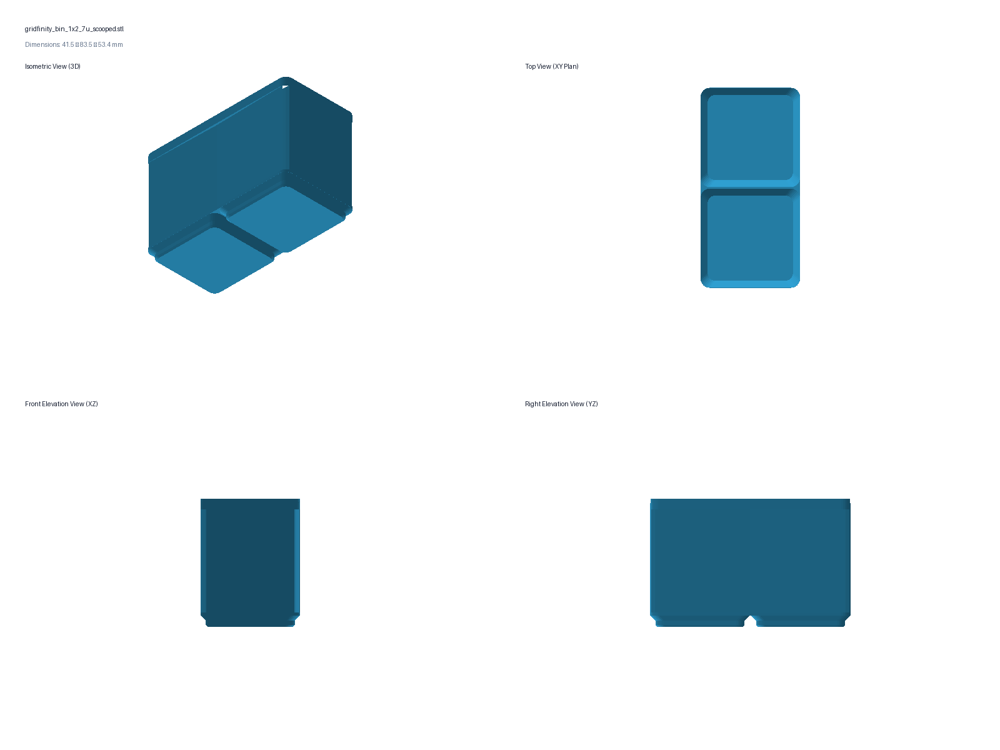
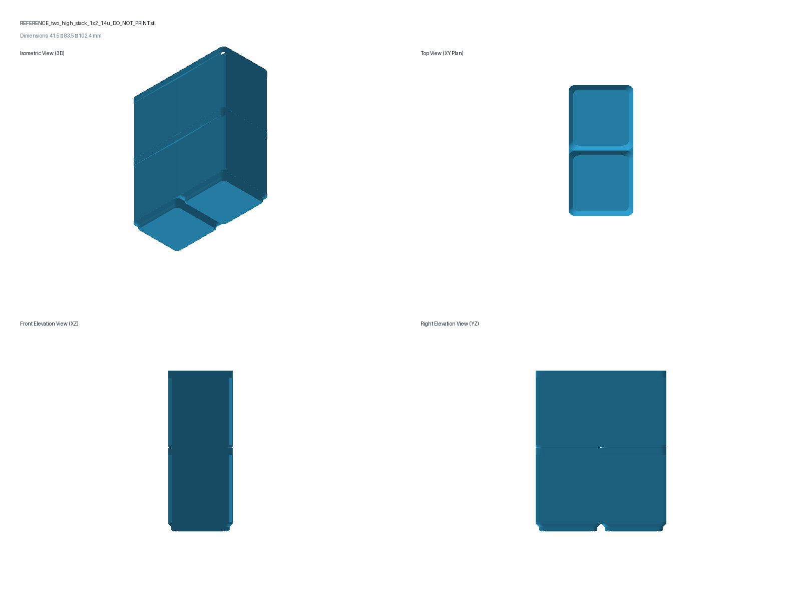

# 1x2 7U Gridfinity Bin with Scooped Inside Front Edge

This model implements a standard **$1 \times 2$ Gridfinity bin** at the standard **7U height** ($49.00\text{ mm}$ engaged height, $53.40\text{ mm}$ total overall height with stacking lip), featuring an ergonomic **curved finger scoop along the inside bottom front floor edge** for effortless small parts retrieval.

---

## 3D Multi-View Visuals

### 1. 1x2 7U Scooped Bin

### 2. Two-High 14U Stack ($102.40\text{ mm}$ engaged height)

---

## Architectural Highlights

1. **Standard $1 \times 2$ Gridfinity Footprint:**
   * Outer dimensions: $41.50 \times 83.50\text{ mm}$ with standard $R = 3.75\text{ mm}$ corner radius ($42.0 \times 84.0\text{ mm}$ nominal pitch).
   * Base: Two standard $42\text{ mm}$ base feet centered at $(0, \pm 21.00\text{ mm})$ with $45^\circ$ stepped profile ($35.6 \to 37.2 \to 41.5\text{ mm}$).
   * Solid base support floor at $Z = 6.00\text{ mm}$.
2. **Authoritative 3D Lofted Stacking Lip:**
   * Monolithic standard Gridfinity stacking lip ($+4.40\text{ mm}$ height, $41.50 \times 83.50\text{ mm}$ outer, $37.20 \times 79.20\text{ mm}$ throat) at $Z = 49.00\text{ to }53.40\text{ mm}$.
   * Continuous 3D lofted profile matching the official Zack Freedman / Gridfinity Rebuilt specification across all four walls and corners.
   * Other Gridfinity bins stack securely directly into the top stacking lip.
3. **Ergonomic Inside Front Finger Scoop:**
   * Smooth concave $R = 6.00\text{ mm}$ cylindrical fillet spanning the entire inside front floor edge ($X \in [-18.75, +18.75\text{ mm}]$).
   * Allows effortless, natural one-finger scooping of tiny screws, nuts, washers, and pins up the front wall.
4. **Cavity & Stacking Capacity:**
   * Internal usable cavity: $37.50\text{ mm}$ width $\times 79.50\text{ mm}$ length $\times 43.00\text{ mm}$ depth ($2.00\text{ mm}$ solid walls).
   * Two identical 7U bins stacked measure **$102.40\text{ mm}$ total height**, leaving **$+8.725\text{ mm}$ clear margin below the measured $111.125\text{ mm}$ drawer ceiling**.

---

## Print Files in `build/`

* **`build/gridfinity_bin_1x2_7u_scooped.stl`** (print upright in PETG, PLA, or ASA with 0 supports)

*Do not print `REFERENCE_*.stl`.*

---

## Dimensional Summary

| Feature | Dimension |
|---|---:|
| Nominal Pitch Footprint | 1 × 2 Gridfinity (42.0 × 84.0 mm) |
| Outside Dimensions | 41.50 × 83.50 mm (r = 3.75 mm) |
| Engaged Stacking Shelf Height (7U) | 49.00 mm |
| Stacking Lip Height | 4.40 mm |
| Total Overall Bin Height | 53.40 mm |
| Base Floor Height | 6.00 mm |
| Usable Cavity Dimensions | 37.50 × 79.50 × 43.00 mm |
| Inside Front Finger Scoop Radius | R = 6.00 mm |
| Two Bins Stacked Total Height | 102.40 mm |
| Drawer Ceiling Clearance (111.125 mm ceiling) | +8.725 mm |
| Mesh Integrity | 0 boundary / 0 non-manifold / 0 degenerate |
