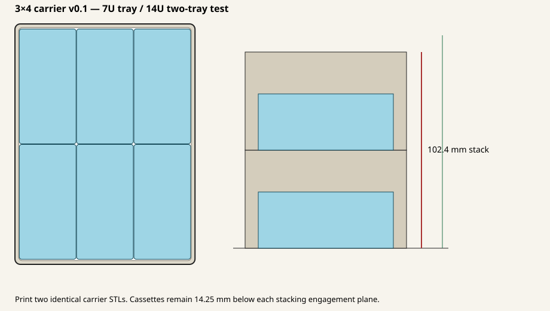

# 3 × 4 Gridfinity carrier — 14U physical test v0.1

This provisional test uses **two identical 7U carriers**. Print two copies of
`build/carrier_3x4_7u_v0_1.stl`; when engaged, they form a 14U stack with a
nominal overall height of 102.4 mm including the exposed top stacking lip.
Inside the measured 111.125 mm drawer, that leaves 8.725 mm nominal clearance.

## Current test status — 2026-08-27

- Carrier 1 of 2 is printing; the slicer estimate is approximately three
  hours. The carrier material and detailed slicer settings have not yet been
  recorded.
- Carrier 2 has not yet been printed and is required to test the engaged stack.
- All carrier fit, stacking, loaded stability, and drawer-clearance results
  remain pending. The dimensions below are modeled values, not physical
  measurements.

Each carrier accepts six v0.6 cassettes in a 3-across × 2-deep arrangement.
The cassette support floor is at Z = 6.75 mm and the stacking engagement plane
is at Z = 49.0 mm. A 28.0 mm closed cassette therefore reaches Z = 34.75 mm,
leaving 14.25 mm below the engagement plane. No cassette, hinge, glass, label,
or pull feature may project above that plane.

## Print set

| File | Quantity | Purpose |
|---|---:|---|
| `build/carrier_3x4_7u_v0_1.stl` | 2 | Printable lower and upper carriers |
| `build/REFERENCE_two_carrier_14u_stack_DO_NOT_PRINT.stl` | 0 | CAD/slicer height reference only |

Print upright as supplied. Reasonable starting settings are a 0.4 mm nozzle,
0.20 mm layers, four perimeters, and no internal support. The carrier walls are
2.6 mm at the working throat, exceeding the project's 2.0 mm minimum.

The 22 mm openings centered in the two long side walls are fingertip-access
openings. They are intended to help lift or push a cassette out without loading
or prying against its glass window. They are not part of the Gridfinity
stacking interface, and their dimensions remain provisional pending this test.

## Physical checks to record

1. Load six closed v0.6 cassettes into each tray and check insertion, removal,
   binding, and rattle. Do not pry against the glass.
2. Stack the loaded carriers and confirm that the upper carrier seats on the
   lip without touching any cassette feature.
3. Measure one carrier's engaged height, the complete two-carrier height, and
   the remaining drawer clearance at several drawer locations.
4. Tip and handle the loaded stack normally, checking that the carrier remains
   engaged and every cassette stays latched.

Record the outcome in `PHYSICAL_TEST_NOTES.md` before changing the carrier
geometry or releasing a new revision.

This release is a physical-fit prototype. Its Gridfinity profile, nominal
120.3 × 162.3 mm throat, 14U drawer result, and access openings remain
provisional until the printed test is reported.

Regenerate with `python3 generate_carrier.py`.
