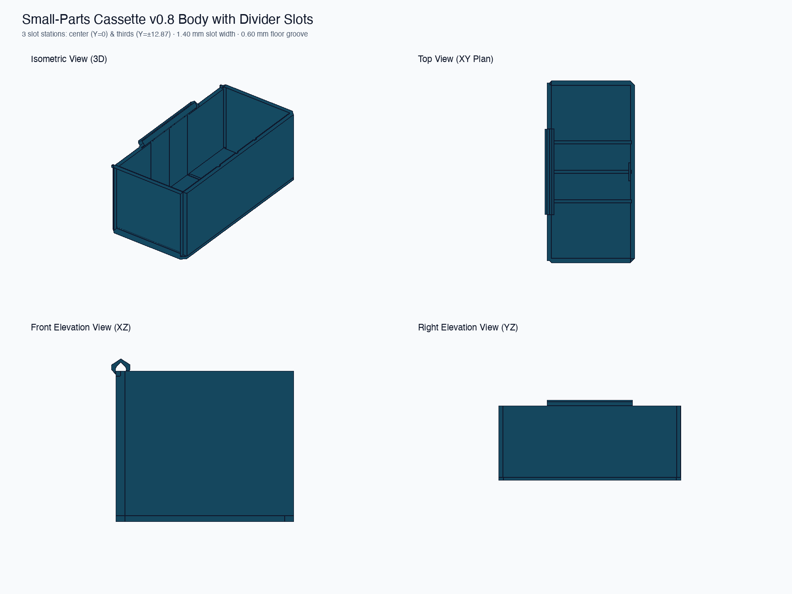

# Plan 003 — Full-Size Cassette Body with Divider Stations (v0.8)

This directory contains the full-size prototype cassette body and divider cards for physical validation of **Plan 003** (Removable Dividers) within the height-optimized **v0.8** cassette architecture.

## Design Summary

- **Cassette Body Envelope:** $38.60 \times 80.00 \times 32.80\text{ mm}$ ($36.0\text{ mm}$ closed height with lid).
- **Usable Cavity:** $34.60\text{ mm}$ width $\times 76.00\text{ mm}$ length $\times 30.80\text{ mm}$ depth.
- **Divider Slot Interface (Station 2 Verified):**
  - Slot width: **$1.40\text{ mm}$** ($+0.20\text{ mm}$ total clearance on $1.20\text{ mm}$ card).
  - Side-wall recess depth: **$0.60\text{ mm}$** into left and right walls ($1.40\text{ mm}$ outer wall remaining).
  - Floor groove depth: **$0.60\text{ mm}$** ($1.40\text{ mm}$ bottom floor remaining).
- **Multi-Station Layout:**
  - **Station 0 (Center, $Y = 0.00\text{ mm}$):** Divides cavity into two equal $37.40\text{ mm}$ compartments.
  - **Stations $\pm 1$ (Thirds, $Y = \pm 12.87\text{ mm}$):** Divides cavity into three equal $24.53\text{ mm}$ compartments.
  - **Zero-Divider Mode:** When dividers are omitted, cavity walls remain flush and unobstructed.

## File Inventory

| File | Description | Triangles | Audit Status |
|---|---|---:|---|
| `build/cassette_body_v0_8_divided.stl` | Full-size body with 3 divider stations | 524 | **0 boundary / 0 non-manifold edges** |
| `build/divider_card_full_1_2mm.stl` | Baseline 1.20 mm divider card ($35.6 \times 31.2\text{ mm}$) | 32 | **0 boundary / 0 non-manifold edges** |
| `build/divider_card_full_1_0mm.stl` | Auxiliary 1.00 mm calibration card | 32 | **0 boundary / 0 non-manifold edges** |
| `build/divider_card_full_1_4mm.stl` | Auxiliary 1.40 mm calibration card | 32 | **0 boundary / 0 non-manifold edges** |
| `generate_divided_cassette.py` | Parametric Python generator script | — | Editable source |
| `build/manifest.json` | Geometry parameters and audit records | — | Machine-readable metadata |

## Print Recommendations

- **Material:** PETG or ASA (PETG recommended for consistency with lid).
- **Slicer Settings:** $0.20\text{ mm}$ layer height, $0.4\text{ mm}$ nozzle, 4 perimeters, 20% infill.
- **Supports:** **No supports required.** Slots print cleanly upright without overhang issues.
- **Divider Cards:** Print flat on the print bed.

## Physical Test Protocol

1. **Long-Wall Flex Evaluation:** Test sliding the 1.20 mm divider card into the center station ($Y = 0$) and thirds stations ($Y = \pm 12.87\text{ mm}$). Check if the full-span 80 mm walls exhibit any bowing, binding, or loose play compared to the short coupon.
2. **Lid & Glass Non-Interference:** Install a verified v0.8/v0.7 lid, glass slide, and 1.75 mm filament hinge pin onto the printed body. Close and latch the lid. Verify that the divider card remains $0.20\text{ mm}$ clear below the lid/glass ceiling and applies zero upward force.
3. **Rollover Spill Test:** Place a counted sample of small hardware (e.g. 10 M3 nuts or 10 M2 washers) in one compartment. Close the cassette, tumble/rotate 360°, and check for part transfer.
