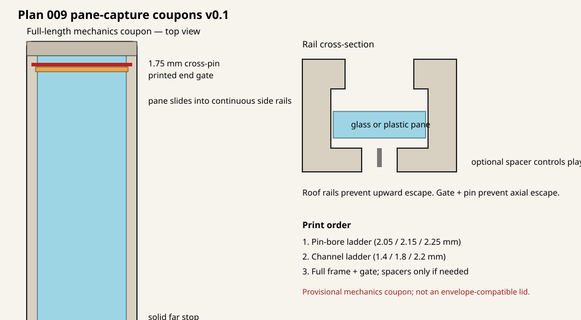

# Glass-capture coupons v0.1 — Plan 009

These are provisional, low-material test articles for replacing the v0.6 snap
retainer. The leading concept loads the pane from one end into continuous roof
rails. A printed end gate covers the exposed pane edge, and a transverse piece
of 1.75 mm filament positively blocks the gate and pane from leaving the entry.

The fit ladders have now been physically tested far enough to select the 2.05 mm
pin bore and 1.4 mm pane channel. Both smallest variants were reported to work
and meet the requirements. The v0.1 full frame does not use those selected
dimensions—it uses a 2.15 mm bore and 2.0 mm channel—so do not print it as the
follow-up article. Use the next versioned mechanics coupon instead.

Wear eye protection, contain all knockout tests, reject damaged glass, and never
force a pane into a coupon.

## Before printing

Measure each pane's width, length, and thickness. Record its material and edge
condition in `PHYSICAL_TEST_NOTES.md`. The modeled maximum glass plan size is
26.3 × 76.3 mm; do not insert an oversize or chipped pane.

## Print order

1. Print `build/pin_bore_fit_ladder_v0_1.stl`. The shortest, middle, and longest
   bosses have 2.05, 2.15, and 2.25 mm nominal bores. Try straight 1.75 mm
   filament by hand and select the smallest bore that inserts reliably without
   drilling or splitting.
2. Print one or more channel coupons:
   `pane_channel_fit_14_v0_1.stl`, `pane_channel_fit_18_v0_1.stl`, and
   `pane_channel_fit_22_v0_1.stl`. Their clear slot heights are 1.4, 1.8, and
   2.2 mm. Insert only the undamaged end of a measured pane. Find the smallest
   slot that slides freely without force, then test the 2.2 mm common channel
   with spacers if a thinner pane rattles excessively.
3. After the bore and channel checks, print
   `endload_crosspin_frame_v0_1.stl` and
   `endload_crosspin_gate_v0_1_print.stl`. Slide the pane into the rails until
   it reaches the far stop, insert the gate behind it, then pass approximately
   31 mm of straight filament through both side bosses behind the gate.
4. Print `pane_spacer_04_v0_1.stl`, `pane_spacer_08_v0_1.stl`, or
   `pane_spacer_12_v0_1.stl` only as needed. A spacer controls vertical movement;
   the rails, gate, and pin—not spacer friction—must prevent pane escape.

Print all parts in their supplied orientation with no scaling. A 0.4 mm nozzle,
0.20 mm layers, and four perimeters are reasonable starting settings. The
0.4/0.8/1.2 mm spacers divide evenly at 0.20 mm layers.

## What this round tests

- Actual pane width and thickness through a 27.0 mm channel.
- A 1.4/1.8/2.2 mm vertical channel ladder.
- Support-free 2.05/2.15/2.25 mm transverse pin bores.
- A common 2.0 mm full-frame slot for different pane thicknesses.
- Positive end blocking independent of snap-retainer preload.
- Whether optional backing spacers adequately control rattle and bowing.

The full frame provides 77.625 mm between the near surface of the 1.75 mm pin
and the far stop. After the 1.0 mm gate, that leaves 0.325 mm modeled length
clearance for a 76.3 mm pane. Total modeled lateral clearance is 0.7 mm around
a 26.3 mm-wide pane.

This first full-length article intentionally exceeds the final cassette's
80.0 mm depth so the gate and transverse-pin mechanics can be tested without
prematurely thinning their supports. It is a mechanics coupon, not a lid or an
envelope-compatible release. A later revision must compact the successful
mechanism back into the verified cassette/carrier envelope.

## Concepts retained for comparison

The pinned end gate is the first coupon because it provides the clearest
positive load path with existing 1.75 mm filament. Before selecting it for a
complete lid, compare it with a sliding underside bezel locked against axial
movement, or another economical positive-capture concept. Friction-only snap
retainers are not an acceptable comparison endpoint.

Regenerate with `python3 generate_glass_capture_coupons.py`.
