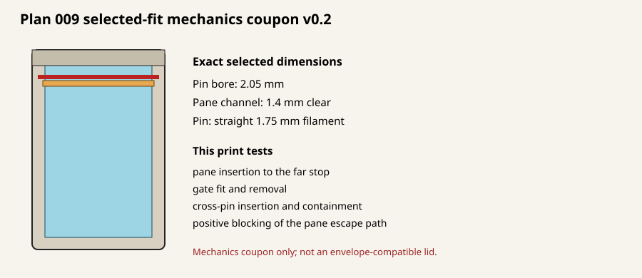

# Glass-capture mechanics coupon v0.2 — Plan 009

This is the next test print after the v0.1 fit ladders. It carries the two
physically selected dimensions forward without changing them:

- 2.05 mm transverse bore for a straight 1.75 mm filament pin.
- 1.4 mm clear pane channel.

Print `build/endload_crosspin_frame_v0_2.stl` and
`build/endload_crosspin_gate_v0_2_print.stl`. Do not print the v0.1 full frame;
it uses a 2.15 mm bore and 2.0 mm channel and was superseded before printing.

## What to test

1. Confirm the measured, undamaged pane slides to the far stop without force.
2. Insert the printed gate behind the pane. It should enter freely and cover the
   pane's exposed end without bowing or loading the pane.
3. Pass approximately 31 mm of straight 1.75 mm filament through both side
   bosses behind the gate. Confirm the pin is contained and removable by hand.
4. With the article inside a protective enclosure, gently pull and invert it in
   several orientations. Confirm the pane cannot pass the gate and pin.
5. Remove and reinstall the gate and pin for ten cycles. Record wear, looseness,
   damage, rattle, and any pane escape path in `PHYSICAL_TEST_NOTES.md`.

Print in the supplied orientations with no scaling and no support. Record the
printer, filament, nozzle, layer height, perimeters, slicer, and measured pane
dimensions. Wear eye protection, reject chipped or oversize glass, and never
force or pry against the pane.

This remains a mechanics coupon, not a lid. At 83.35 mm overall depth it
intentionally exceeds the 80.0 mm cassette envelope. It tests positive end
blocking before the mechanism is compacted into a new cassette-lid revision.
It also validates only the currently selected pane fit; the common interface for
an alternate transparent pane thickness remains an open Plan 009 requirement.

Regenerate with `python3 generate_glass_capture_coupons.py`.

