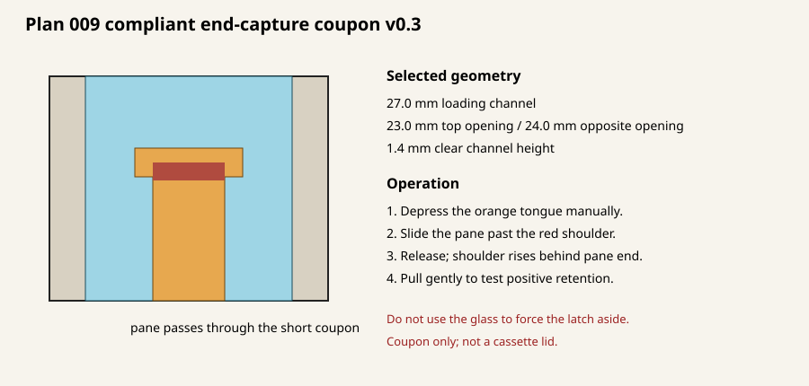

# Compliant end-capture coupon v0.3 — Plan 009

Print `build/compliant_end_capture_coupon_v0_3.stl`. This short article replaces
the failed v0.2 gate and filament retaining pin with one integral compliant
latch. It is not a cassette lid.

## Supplied print orientation

Print the STL exactly as supplied, with the visible/top face on the bed. Do not
scale it and do not add support inside the pane channel. The 2.0 mm top capture
ledges are bed-supported in this orientation; the opposite 1.5 mm ledges test
whether the remaining functional overhang prints cleanly enough.

Use PETG for the first compliant-latch test unless documenting another material.
A 0.4 mm nozzle, 0.20 mm layers, and four perimeters are reasonable starting
settings. Record the actual settings in `PHYSICAL_TEST_NOTES.md`.

## Test procedure

1. Inspect the 24.0 mm opposite opening and 1.4 mm channel for sag. Do not insert
   glass if cleanup would expose a sharp surface or substantially alter capture.
2. Hold the coupon clear of the work surface so the tongue can move toward the
   printed top face. Depress the orange/central finger pad manually until the
   positive shoulder clears the pane path.
3. Slide the undamaged 24.9 mm-wide glass through the 27.0 mm channel and past
   the shoulder. Do not use the glass edge to cam or force the latch aside.
4. Release the tongue. Confirm the shoulder returns fully behind the pane end,
   then pull gently toward the entry. The shoulder—not friction—must stop it.
5. Confirm the pane cannot pass either the 23.0 mm top opening or 24.0 mm
   opposite opening. Record rattle, scratching, bowing, and any escape path.
6. If all checks pass, complete 25 manual release/re-engagement cycles. Stop for
   whitening, cracking, permanent set, rail damage, glass damage, or incomplete
   latch return.

Wear eye protection and keep the glass contained. Reject chipped or oversize
glass. Do not perform impact or rollover testing with this short article.

Regenerate with `python3 generate_glass_capture_coupon.py`.

