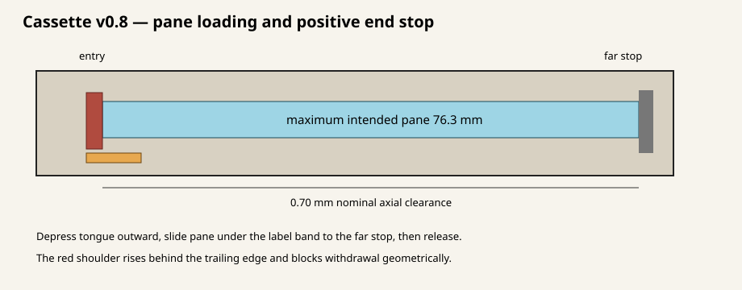
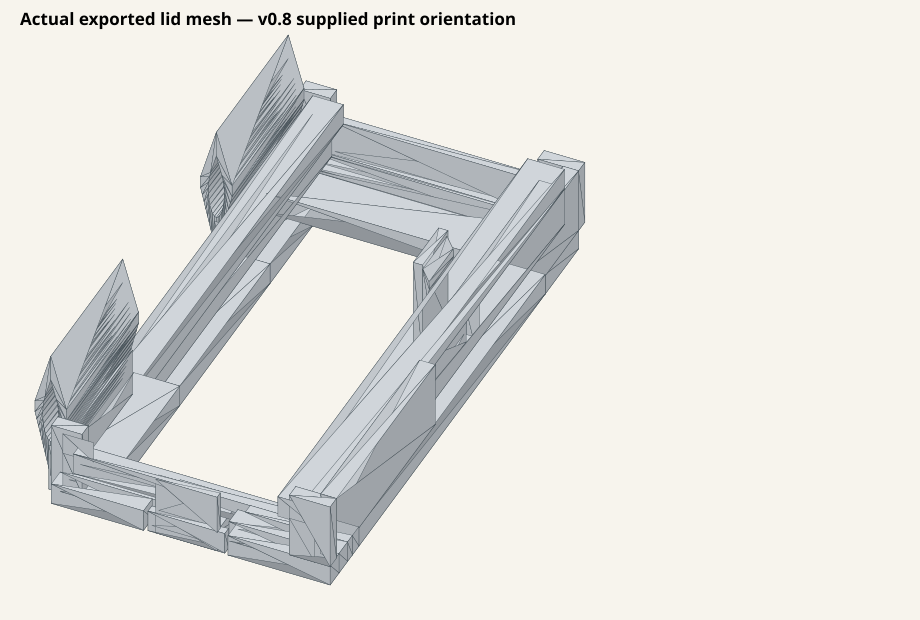

# Glass-slide small-parts cassette — prototype v0.8 (Optimized Height)

Version 0.8 implements the vertical height optimization established in **Plan 002**.
It increases the closed cassette envelope to **$39.55 \times 80.0 \times 41.0\text{ mm}$**
(body height $37.80\text{ mm}$, lid height $3.20\text{ mm}$), providing **$35.80\text{ mm}$ of
usable internal cavity depth** (+57% internal volume increase over the v0.7 baseline)
while maintaining a clean **$1.25\text{ mm}$ safety margin** below the 7U carrier
stacking engagement plane ($Z = 49.00\text{ mm}$, cassette floor $Z = 6.75\text{ mm}$).

Key features:
1. **Optimized Usable Depth:** $35.80\text{ mm}$ internal cavity depth with $2.0\text{ mm}$ solid floor.
2. **Backwards Compatibility:** Retains the physically verified v0.7 lid geometry, positive end-loaded glass retention channel, 6.75 mm compliant PETG latch, and 3-knuckle peaked filament hinge.
3. **Aligned Split-Line Clasp:** Reinforced closure catch on the body wall is located at $Z = 35.30\text{--}36.58\text{ mm}$ with $0.65\text{ mm}$ undercut interference.
4. **Stacked Tray Non-Interference:** When loaded inside a 3 × 4 × 7U carrier tray, an upper carrier tray seats completely on the stacking lip with $1.25\text{ mm}$ clearance above the closed cassette lid.






## Print these files

- `build/cassette_body_v0_8.stl` (print upright in PETG or ASA)
- `build/cassette_lid_v0_8_print.stl` (print top/label-face down in PETG; identical geometry to v0.7 lid, so existing v0.7 lids are 100% reusable)

Print both parts exactly as supplied without internal support. A 0.4 mm nozzle,
0.20 mm layers, and four perimeters remain reasonable starting settings. Keep the
seam away from the hinge bores and record the actual material, printer, slicer, and
settings in `PHYSICAL_TEST_NOTES.md`.

Do not print `REFERENCE_closed_assembly_DO_NOT_PRINT.stl`.

## Pane-capture geometry

| Feature | Dimension |
|---|---:|
| Loading channel | 27.0 mm wide × 1.4 mm clear height |
| Top/visible opening | 23.0 mm |
| Opposite opening | 24.0 mm |
| Tested glass width | 24.9 mm |
| Overlap per side on tested glass | 0.95 mm top / 0.45 mm opposite |
| Maximum intended pane | 26.3 × 76.3 × 1.2 mm |
| Axial clearance at 76.3 mm length | 0.70 mm |
| PETG tongue | 8.0 mm wide × 0.8 mm thick × 6.75 mm free length with 45° root gussets |
| Latch finger pad | 10.0 mm wide |
| Frame entry slot cutout | Tight 0.50 mm perimeter outline (11.0 mm pad cut / 9.0 mm tongue cut) |
| Relaxed tongue-to-glass gap | Flush at channel ceiling (0.2–0.3 mm clearance over 1.1–1.2 mm glass) |

The pane enters at the end opposite the label, slides under the solid label band,
and stops at the far end. Manually depress the compliant tongue outward, slide
the pane completely past the shoulder, then release it. The shoulder returns
behind the trailing pane edge and blocks withdrawal. It must not remain pressed
against the glass face, and the glass must not be used to cam the latch aside.

The 23.0 × 58.5 mm visible window and 34.0 × 10.0 mm label zone are unchanged.
The full closed envelope is **39.55 × 80.0 × 41.0 mm**.

## Hinge and Clasp Features

- Original three-knuckle removable-pin hinge.
- 2.25 mm nominal body bore and 2.10 mm nominal lid bores with support-free peaked profiles.
- Continuous bed-supported roots beneath both lid knuckles.
- 0.20 mm root overlap past the hinge axis.
- 0.8 mm axial knuckle gaps and checked 0–120 degree sweep.
- Reinforced closure snap: 1.20 mm cantilever beam on lid with 0.65 mm undercut catch on body wall.
- 34 × 10 mm label zone and cassette/carrier envelope.

## Assembly and test order

1. Inspect the printed body, pane channel, opposite ledges, tongue root, hinge roots,
   and bores.
2. Insert pane into lid by depressing compliant tongue manually. Slide pane to far stop and release.
3. Assemble the lid to the body with approximately 75 mm of straight 1.75 mm filament.
4. Verify smooth hinge rotation through at least 120 degrees and positive clasp closure.
5. Place cassette inside a 3 × 4 carrier tray and stack a second carrier tray on top to confirm full seating without contact.

## Export validation

The binary v0.8 lid contains 780 triangles and the v0.8 body contains 376 triangles,
each reporting zero boundary edges, zero non-manifold edges, zero degenerate triangles,
and finite coordinates. Their binary sizes and encoded triangle counts were re-read after
export. The body, lid, and reference assembly retain the 39.55 × 80.0 × 41.0 mm maximum closed envelope.

Regenerate all current artifacts with:

```bash
python3 generate_cassette.py --out build --preview
```
