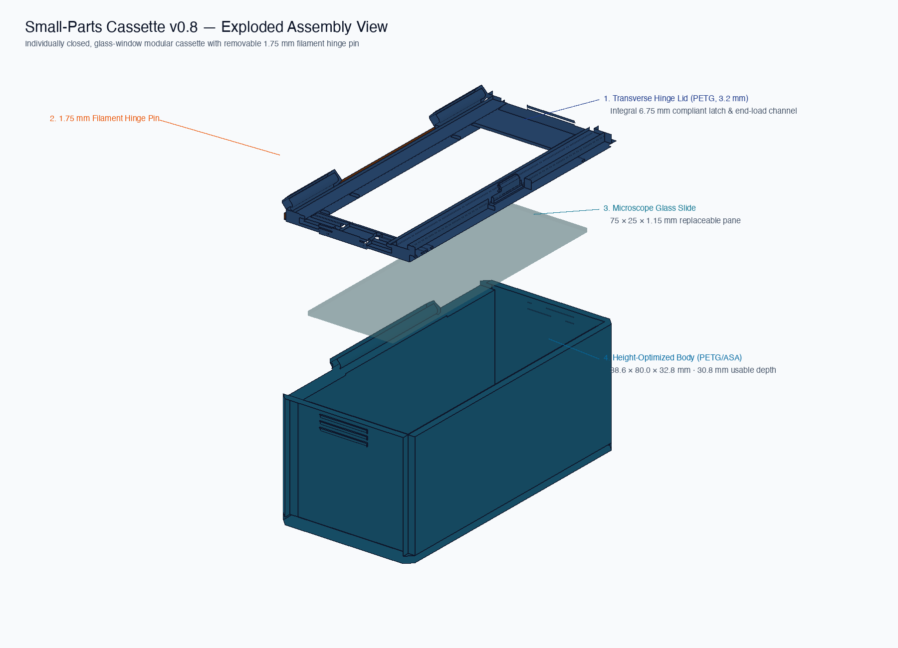
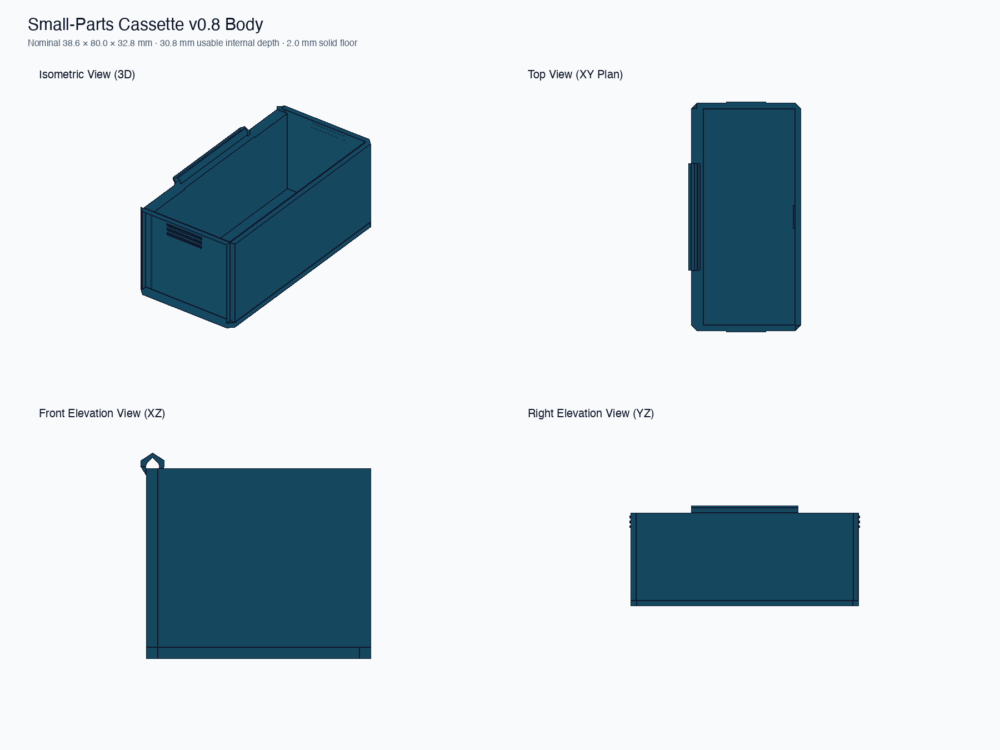
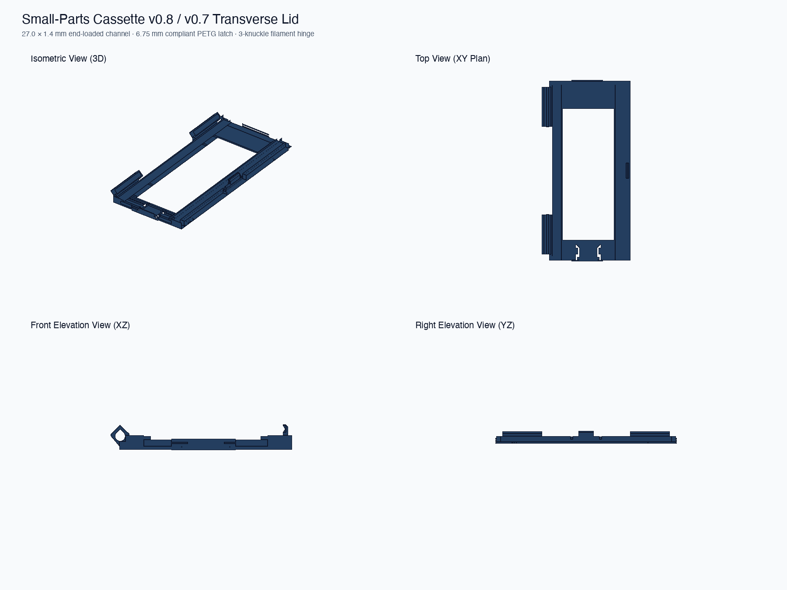

# Glass-Slide Small-Parts Cassette — Production Release Candidate (Plan 004)

This release consolidates all physically verified features from Plans 001–003 into the canonical smallest cassette standard within the **14U / 7U Gridfinity carrier system**:

1. **Height-Optimized Capacity (Plan 002):**
   - Closed envelope: **$39.55 \times 80.00 \times 36.00\text{ mm}$** (body height $32.80\text{ mm}$, lid height $3.20\text{ mm}$).
   - **$30.80\text{ mm}$ usable internal depth** (+35.1% capacity increase over baseline).
   - Safe **$+1.50\text{ mm}$ clearance margin** below upper carrier tray Gridfinity feet in a 14U stack.
2. **Straight-Line Vertical Drop-In & Wall Rigidity (Plan 003 / 004):**
   - Inner left wall thickened to **$4.30\text{ mm}$** (inner face at $X = -15.00\text{ mm}$).
   - Provides **$+0.65\text{ mm}$ of clear vertical drop-in air** past the inward-sloping hinge knuckle peak ($X = -16.15\text{ mm}$) and eliminates long-wall flex.
3. **Refined Outer Hinge Ramp & Flush Corner Transitions (Plan 004):**
   - $45^\circ$ transitional support ramp beneath the outer hinge knuckle eliminates outer overhang droop.
   - Flush relief across the entire hinge-side end zones eliminates legacy $1\text{ mm}$ corner step blocks.
4. **Ergonomic Tactile End Pinch Ribs (Plan 004):**
   - 3 horizontal tactile ridges on front and back end walls ($Y = \pm 40.00\text{ mm}$) below the rim provide secure finger purchase for extraction from packed 3 × 4 carrier trays.
5. **Removable Divider System (Plan 003):**
   - Two thirds stations at $Y = \pm 12.87\text{ mm}$ divide the cavity into three equal **$24.53\text{ mm}$** compartments.
   - $1.40\text{ mm}$ slot width, $0.60\text{ mm}$ wall recess, and $0.60\text{ mm}$ floor groove maintain smooth cavity walls when omitted.
6. **Positive Slide Glass Retention (Plan 009):**
   - End-loaded $27.0 \times 1.4\text{ mm}$ channel, integral $6.75\text{ mm}$ compliant PETG latch with tight $0.50\text{ mm}$ cutout, and $34 \times 10\text{ mm}$ label zone for 9 mm Brother TZe tape.







## Printable File Inventory

| File | Description | Triangles | Audit Status |
|---|---|---:|---|
| `build/cassette_body_v0_8_divided.stl` | Divided body (2 thirds stations) with thickened hinge wall & end pinch ribs | 536 | **0 boundary / 0 non-manifold edges** |
| `build/cassette_body_v0_8.stl` | Undivided body with thickened hinge wall & end pinch ribs | 428 | **0 boundary / 0 non-manifold edges** |
| `build/cassette_lid_v0_8_print.stl` | Production lid (end-loaded slide capture, compliant PETG latch, end ribs) | 868 | **0 boundary / 0 non-manifold edges** |
| `build/divider_card_1_2mm.stl` | Baseline 1.20 mm divider card ($33.30 \times 31.20 \times 1.20\text{ mm}$) | 48 | **0 boundary / 0 non-manifold edges** |
| `build/divider_card_1_0mm.stl` | Auxiliary 1.00 mm calibration card | 48 | **0 boundary / 0 non-manifold edges** |
| `build/divider_card_1_4mm.stl` | Auxiliary 1.40 mm calibration card | 48 | **0 boundary / 0 non-manifold edges** |

## Print Recommendations

- **Body & Divider Cards:** PETG or ASA. Print body upright, divider cards flat on bed. No supports required.
- **Lid:** PETG (required for integral compliant latch flexure). Print top/label-face down. No supports required.
- **Settings:** 0.4 mm nozzle, 0.20 mm layer height, 4 perimeters, 20% infill. Keep seams away from hinge bores.
- **Hinge Pin:** ~75 mm length of straight 1.75 mm printer filament.

## Assembly & Testing

1. Inspect printed parts and slide channel.
2. Insert standard plain glass slide ($75 \times 25 \times 1.1\text{--}1.2\text{ mm}$) by manually depressing the compliant PETG tongue. Slide to far stop and release tongue to lock.
3. Align lid with body and insert the 1.75 mm filament pin through the 3 knuckles.
4. Verify smooth rotation through 120°+ and positive snap engagement of the closure clasp.
5. If using dividers, drop 1.20 mm divider cards straight down into either or both slot stations ($Y = \pm 12.87\text{ mm}$).
6. Load six cassettes into a 3 × 4 × 7U carrier tray and test extraction using the tactile end pinch ribs.
7. Stack a second loaded carrier on top to confirm full seating with $+1.50\text{ mm}$ clearance below upper feet.

Regenerate all artifacts with:

```bash
python3 generate_cassette.py
```
