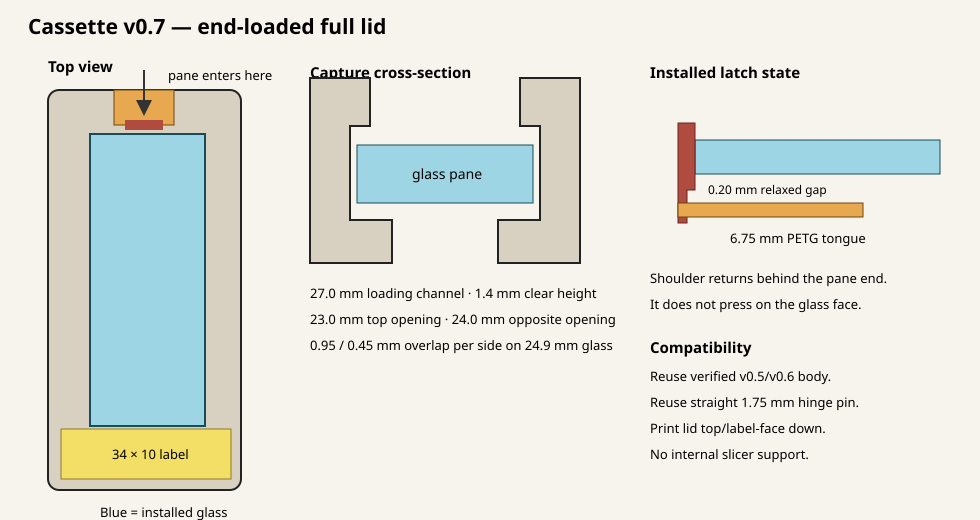
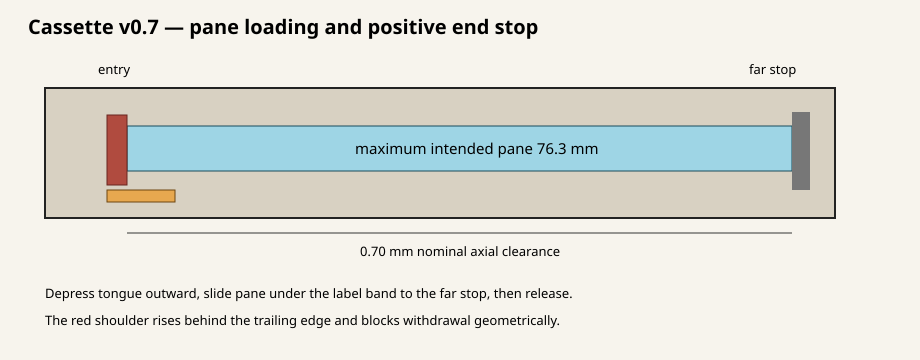

# Glass-slide small-parts cassette — prototype v0.7

Version 0.7 is the first complete lid integrating the physically successful
Plan 009 end-loaded pane channel and shortened compliant PETG latch. It replaces
the v0.6 snap-retainer artifacts in this working directory; Git retains the
tested v0.6 history.

Only the lid needs to be printed for this test. The generated v0.7 body is
coordinate-for-coordinate identical to v0.6, which is geometrically identical
to the physically verified v0.5 body. Reuse a successful v0.5 or v0.6 body and
the existing straight 1.75 mm filament hinge pin.






## Print this file

- **Bambu Studio project:** `build/cassette_lid_v0_7_print.3mf`
- **Binary STL:** `build/cassette_lid_v0_7_print.stl`
- *(Full set project if printing both body and lid: `build/cassette_v0_7_full_set.3mf`)*

Print it exactly as supplied, top/label-face down, in PETG. Do not scale it and
do not add support inside the pane channel or hinge. A 0.4 mm nozzle, 0.20 mm
layers, and four perimeters remain reasonable starting settings. Keep the seam
away from the hinge bores and record the actual PETG, printer, slicer, and
settings in `PHYSICAL_TEST_NOTES.md`.

Do not print `REFERENCE_closed_assembly_DO_NOT_PRINT.stl`. The generated
`cassette_body_v0_7.stl` is included as the current source-derived reference,
but it is not required when reusing a successful v0.5/v0.6 body.

## Pane-capture geometry

| Feature | Dimension |
|---|---:|
| Loading channel | 27.0 mm wide × 1.4 mm clear height |
| Top/visible opening | 23.0 mm |
| Opposite opening | 24.0 mm |
| Tested glass width | 24.9 mm |
| Overlap per side on tested glass | 0.95 mm top / 0.45 mm opposite |
| Maximum intended pane | 26.3 × 76.3 × 1.2 mm |
| Axial clearance at 76.3 mm length | 0.70 mm |
| PETG tongue | 8.0 mm wide × 0.8 mm thick × 6.75 mm free length with 45° root gussets |
| Latch finger pad | 10.0 mm wide |
| Frame entry slot cutout | 13.0 mm wide (1.5 mm lateral clearance per side) |
| Relaxed tongue-to-glass gap | Flush at channel ceiling (0.2–0.3 mm clearance over 1.1–1.2 mm glass) |

The pane enters at the end opposite the label, slides under the solid label band,
and stops at the far end. Manually depress the compliant tongue outward, slide
the pane completely past the shoulder, then release it. The shoulder returns
behind the trailing pane edge and blocks withdrawal. It must not remain pressed
against the glass face, and the glass must not be used to cam the latch aside.

The 23.0 × 58.5 mm visible window and 34.0 × 10.0 mm label zone are unchanged.
The full closed envelope remains 39.55 × 80.0 × 28.0 mm.

## Preserved v0.6 geometry

- Original three-knuckle removable-pin hinge.
- 2.10 mm nominal lid bores and support-free peaked profiles.
- Continuous bed-supported roots beneath both lid knuckles.
- 0.20 mm root overlap past the hinge axis.
- 0.8 mm axial knuckle gaps and checked 0–120 degree sweep.
- Existing body catch, lid closure tongue, and fingernail opening relief.
- 34 × 10 mm label zone and cassette/carrier envelope.

The regenerated v0.7 body has the same 376 triangles and identical triangle
coordinates as the checked-in v0.6 body. All 352 lid hinge-shell triangles are
also present unchanged in both the v0.6 and v0.7 exported lids.

## Assembly and test order

1. Inspect the printed pane channel, opposite ledges, tongue root, hinge roots,
   and bores. Stop for cracks, incomplete tongue return, or obstructive sag.
2. With the lid held clear of the work surface, depress the pane tongue manually.
   Insert only an undamaged, measured pane; never force or pry the glass.
3. Slide the pane to the far stop, release the tongue, and confirm the shoulder
   returns fully behind the pane without touching its face.
4. Gently pull the pane toward the entry. Positive shoulder engagement—not
   friction—must prevent withdrawal.
5. Assemble the lid to the verified body with approximately 75 mm of straight
   1.75 mm filament. Verify hinge motion through at least 120 degrees and normal
   body-latch closure.
6. Evaluate perimeter-supported lid stiffness, glass rattle/bowing, latch access,
   label clearance, and glass replacement for 25 cycles.
7. Only after those checks pass, test loaded rollover and the documented knockout
   comparison inside a protective enclosure.

Wear eye protection and contain the specimen during rollover or impact work.
Reject chipped, cracked, scratched, or oversize glass immediately.

## Export validation

The binary v0.7 lid contains 692 triangles and reports zero boundary edges, zero
non-manifold edges, zero degenerate triangles, and finite coordinates. Its binary
size and encoded triangle count were re-read after export. The body, lid, and
reference assembly retain the 39.55 × 80.0 × 28.0 maximum closed envelope.

Regenerate all current artifacts with:

```bash
python3 generate_cassette.py --out build --preview
```
