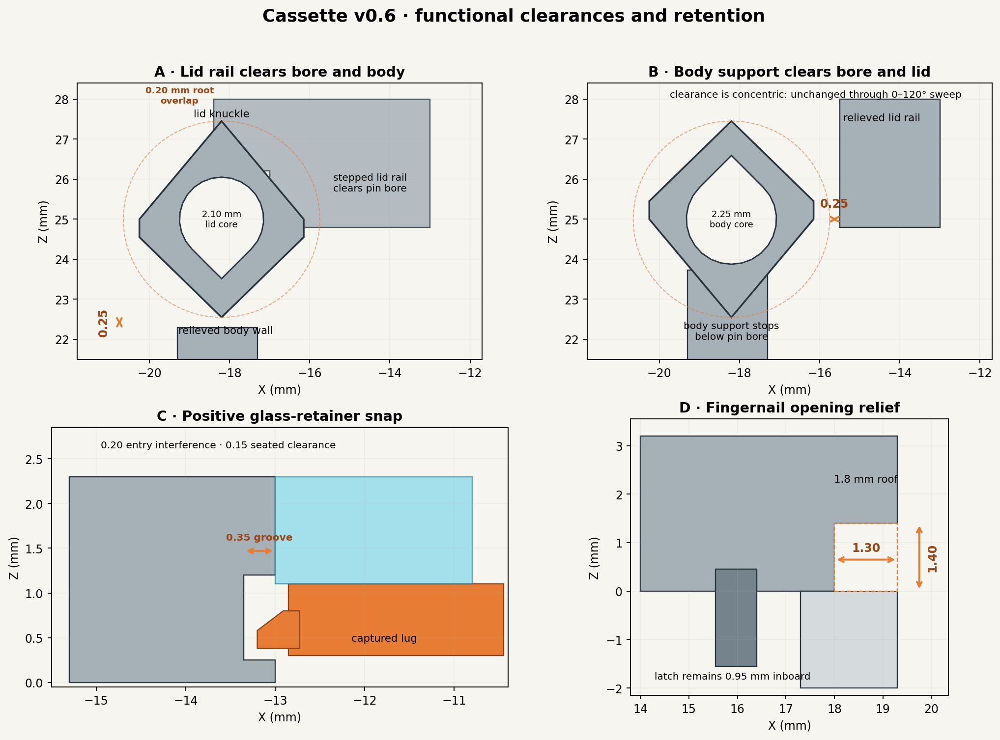
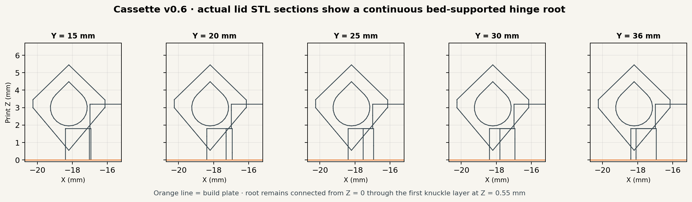
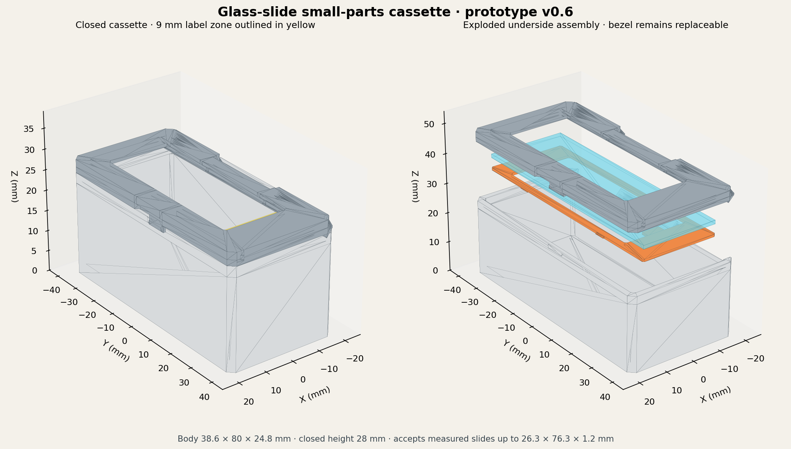

# Glass-slide small-parts cassette — prototype v0.6

This is the smallest cassette in the proposed system: a printed small-parts box with a replaceable plain microscope-slide window and a flat area for 9 mm TZe tape.

Version 0.6 corrects the unsupported root visible in the v0.5 lid STL:

- Both lid knuckles now grow from continuous, bed-supported roots across their complete lengths.
- Each root extends 0.20 mm past the hinge axis and overlaps the knuckle by a positive volume.
- The roots still stop 0.15 mm above the 2.10 mm lid bores, so they cannot obstruct the filament pin.
- The v0.5 body-bore increase to 2.25 mm is retained without alteration.
- The body, glass pocket, latch, and retainers are unchanged from v0.5.

Physical testing with PETG confirmed that the Firmest 0.45 retainer held the
glass in place best. The hinge also works well with straight 1.75 mm printer
filament as its removable pin. The tested v0.5 body may be reused with the v0.6
lid, and the selected Firmest 0.45 retainer is the default for this print setup.







## v0.6 lid-root correction

In the supplied top-face-down print orientation, the lowest point of each v0.5 lid knuckle began 0.55 mm above the build plate. The upper lid rail was intended to support it, but that rail tapered away from the hinge axis toward the inner end of each knuckle. Actual STL cross-sections show that much of the knuckle therefore began as a detached cantilever and did not meet the frame until later layers.

Version 0.6 adds a closed, bed-supported root beneath each lid knuckle. Each root:

- begins at the build plate and remains solid for the first 1.80 mm of print height;
- extends 0.20 mm past the hinge axis, supporting the knuckle from its first 0.55 mm-high layer;
- continues 1.25 mm above that first knuckle layer;
- overlaps each end of its knuckle by 0.10 mm along the pin axis;
- remains 0.70 mm from the body knuckle and 0.15 mm from the full-height body end wall; and
- is collision-free against the relieved body wall through a sampled 0–120 degree opening sweep.

The v0.4 and v0.5 lids share the tapered-root geometry and should not be printed for the next test. The v0.6 lid is the replacement.

## Retained v0.5 body-bore adjustment

The v0.4 body hinge was functional but its longer, less-supported bore deformed inward enough to require manual opening. Increasing only that nominal core by 0.15 mm in diameter raises its minimum modeled radial clearance around 1.75 mm filament from approximately 0.168 to 0.242 mm. The lid knuckles retain the closer fit and therefore continue to locate the pin without adding unnecessary hinge play.

The v0.6 body is geometrically identical to the v0.5 body. If the v0.5 body or body coupon already printed successfully, it may be reused with the new v0.6 lid.

## Why v0.3 should not be printed

The v0.3 knuckle shells had open, valid teardrop bores, but the lid rail and body support were modeled as separate overlapping solids. When a slicer unions those solids, the rectangular attachments intrude into the hollow knuckle shells. The lid rail could fill approximately the inner half of each lid bore, and the body support could fill the lower portion of the centre bore.

That defect was not detected by the earlier manifold audit because each overlapping shell was closed by itself. Versions 0.4 through 0.6 include explicit attachment-to-bore checks in addition to the shell topology checks. Version 0.6 also checks the lid-root support height, axial clearances, and opening sweep.

## Earlier design provenance and the v0.2 failure

The v0.1/v0.2 hinge was not copied from a tested published model. It was an original implementation of a conventional three-knuckle, removable-pin hinge. Its geometry and rotational clearances were checked, but the printability check was insufficient: a valid mesh and collision-free sweep do not prove that a long horizontal circular bore will print cleanly in PETG.

The v0.2 instructions suggested painted-on support below the knuckles and gently clearing the 2.10 mm bore with a 2.0 mm drill. Those measures can correct a slightly curled outer edge or mild hole shrinkage. They do not adequately fix repeated sagging at the unsupported roof of a horizontal bore, and internal support would be difficult to remove from the long centre knuckle.

## Replacement hinge

The v0.6 hinge keeps the removable 1.75 mm filament pin and support-free peaked profile:

- The outer underside begins at a supported point and grows outward at approximately 40 degrees from vertical.
- The body bore has a 2.25 mm nominal round core; the lid bores remain 2.10 mm. All close under two 45-degree tangent roofs instead of a circular ceiling.
- The body and lid use opposite profile orientations so each is support-free in its supplied print orientation.
- A 2.45 mm-radius rotational keep-out surrounds each non-round knuckle, with another 0.25 mm clearance to the mating wall or rail throughout the 0–120 degree sweep.
- The polygonized body bore leaves approximately 0.242 mm minimum radial model clearance around nominal 1.75 mm filament; the lids retain approximately 0.168 mm.
- The lower lid rail begins 0.15 mm beyond the bore and steps back over the knuckle only after it is 0.15 mm vertically above the bore.
- A continuous root beneath each lid knuckle reaches 0.20 mm past the hinge axis, eliminating the v0.5 floating start.
- The body support terminates 0.15 mm below the centre-knuckle bore.

Do not print or reuse the v0.3 body or lid. Pair the v0.6 lid with a v0.5 or v0.6 body. The glass pane and retainers remain compatible with the grooved v0.2 through v0.6 lids.

## Stronger retainer ladder

The lid groove is 0.35 mm deep per side. The existing firm retainer is now the lightest reference in the stronger ladder:

| Retainer | Lug projection per side | Nominal state after seating |
|---|---:|---:|
| Existing firm | 0.30 mm | 0.05 mm groove clearance |
| Firm+ — new | 0.35 mm | Fills groove, no preload |
| Firmer — new | 0.40 mm | 0.05 mm preload |
| Firmest — new | 0.45 mm | 0.10 mm preload |

The Firmest 0.45 retainer worked best in physical testing with PETG and is the
selected full-size retainer for the current print setup. If the material,
printer, nozzle, extrusion, or slicer settings change, recalibrate by testing
the retainers upward in order. The 0.40 and 0.45 mm versions intentionally flex
the PETG rails after seating. Do not force a retainer that requires levering
against the glass.

The glass is part of the installed stack and acts as the retainer's upper stop. A full retainer tested in an empty lid can move farther into the pocket and feel less positively located than it will with the correctly sized slide installed. Make the final choice with the glass present.

## Key dimensions

| Feature | Dimension |
|---|---:|
| Nominal body | 38.6 × 80.0 × 24.8 mm |
| Maximum closed envelope | 39.55 × 80.0 × 28.0 mm |
| Internal cavity before hinge/latch intrusion | 34.6 × 76.0 × 22.8 mm |
| Glass pocket | 27.0 × 76.8 × 2.3 mm deep |
| Maximum intended measured slide | 26.3 × 76.3 × 1.2 mm |
| Visible window | 23.0 × 58.5 mm |
| Flat TZe label zone | 34.0 × 10.0 mm |
| Hinge pin | 1.75 mm filament |
| Body hinge core | 2.25 mm nominal |
| Lid hinge cores | 2.10 mm nominal |
| Lid-knuckle root overlap | 0.20 mm past hinge axis |
| Body wall and floor | 2.0 mm |

The glass remains recessed 0.9 mm below the printed top surface. Measure the delivered slides and never force an oversize or chipped pane into the pocket.

## Files to print first

| File | Purpose |
|---|---|
| `build/hinge_test_lid_v0_6_print.stl` | Revised lid-side test with continuous supported roots |
| `build/hinge_test_body_v0_6.stl` | Unchanged matching body-side test; reuse v0.5 if successful |
| `build/glass_fit_coupon_v0_6.stl` | Existing pocket/groove test section |
| `build/glass_snap_fit_clip_firm_plus_035_v0_6.stl` | New 0.35 mm/side clip, four pips |
| `build/glass_snap_fit_clip_firmer_040_v0_6.stl` | New 0.40 mm/side clip, five pips |
| `build/glass_snap_fit_clip_firmest_045_v0_6.stl` | New 0.45 mm/side clip, six pips |

The matching full-size retainers are:

- `build/glass_retainer_firm_plus_035_v0_6.stl`
- `build/glass_retainer_firmer_040_v0_6.stl`
- `build/glass_retainer_firmest_045_v0_6.stl`

The package also contains the original light, nominal, and firm retainers, full v0.6 body and lid, editable generator, previews, reference assembly, and audit manifest.

## Lowest-cost validation order

Physical testing has verified that the v0.6 lid works with the v0.5 body using
straight 1.75 mm printer filament as the hinge pin. The hinge operates well.
The Firmest 0.45 PETG retainer also provided the best tested hold on the glass.

The body, hinge coupons, and retainer-fit samples remain included for future
recalibration, but they do not need to be repeated solely for v0.6 when using
the same material and print setup.

## Print settings

- 0.4 mm nozzle, 0.20 mm layers, and four perimeters are reasonable starting settings.
- Use the supplied orientations. The body is upright; the lid has its top/label face on the bed.
- Print retainers and snap clips flat. A 0.16 or 0.20 mm layer height divides the 0.8 mm bezel evenly.
- Do not generate support inside or beneath the new hinge. Its pointed outside and 45-degree bore roof are specifically designed to print unsupported.
- Keep the seam away from the inner bore where possible.
- The enlarged body core is intended to eliminate manual opening. If a lid bore is dimensionally tight, a 2.0 mm drill may still be turned gently by hand through that 2.10 mm core. Do not power-drill the knuckles.
- Do not scale parts in the slicer; adjust the named source parameters instead.

## Assembly

1. Deburr the glass pocket and inspect the slide. Discard chipped glass.
2. Place the lid upside down and lower the glass into the recess until it rests against the shoulder around the window.
3. Align the selected retainer with its pull tab at the label end. Start one long edge, bow the opposite rail inward slightly, and press evenly until all four lug locations engage.
4. Alternate the two lid knuckles around the body centre knuckle. Push approximately 75 mm of straight 1.75 mm filament through the full hinge. If needed, secure only the exposed ends with a tiny reversible dab of PVA or hot glue.
5. Close the hidden right-side latch. Open it by lifting the printed frame at the fingernail recess, not the glass.
6. Apply a 9 mm TZe label within the 34 × 10 mm solid band.

Optional clear polyester safety film can be applied to the parts-facing side of the glass to retain most fragments if it breaks. Trim the film inside the pane perimeter so it does not alter the fit.

## Source and validation

Regenerate with:

```bash
python generate_cassette.py --out build --preview
```

STL generation uses only the Python standard library; PNG previews require Matplotlib. The generator checks the hinge keep-out clearance, self-supporting profile slopes, minimum pin clearance, lid-root overlap and support height, root axial clearances, the root/body opening sweep at 0.5-degree increments, cassette envelope, and mesh topology. All individual printable STLs in the manifest must report zero boundary and zero non-manifold edges.

The hinge-inclusive footprint remains 39.55 × 80.0 mm. A future 3 × 2 array with 0.4 mm gaps remains 119.45 × 160.4 mm and therefore still fits the planned 3 × 4 Gridfinity carrier throat.
