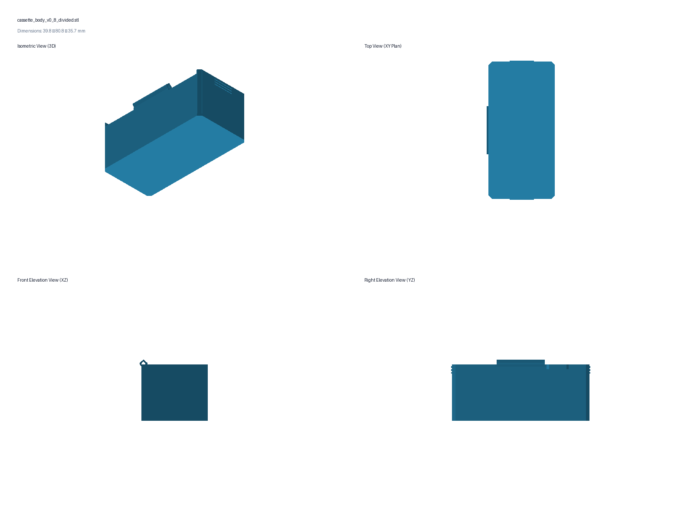
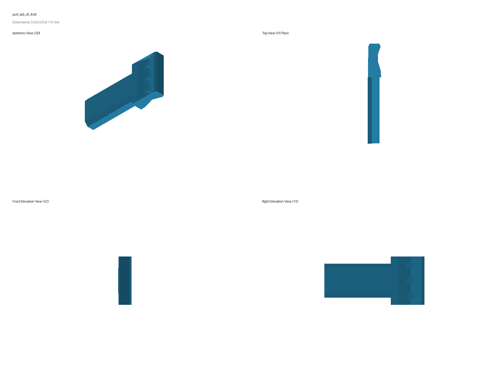

# Glass-slide small-parts cassette — prototype v0.8 (Optimized Height, Body Pull Tab & Dividers)

Version 0.8 implements the vertical height optimization (Plan 002), removable divider system (Plan 003), internal flanking wall ridges with reinforced closure clasp (Plan 010), $1.20\text{ mm}$ reinforced compliant glass retention clip, and body-anchored vertical dovetail pull tab for effortless in-drawer extraction (Plan 011).
It establishes the closed cassette envelope at **$39.55 \times 80.0 \times 36.4\text{ mm}$**
(body height $32.80\text{ mm}$, lid height $3.60\text{ mm}$), providing **$30.80\text{ mm}$ of
usable internal cavity depth** (+35.1% internal volume increase over the v0.7 baseline)
while maintaining a safe **$1.10\text{ mm}$ clearance margin** below the upper carrier
tray's bottom Gridfinity feet (lowest foot surface at $Z = 44.25\text{ mm}$, cassette floor at $Z = 6.75\text{ mm}$).

Key features:
1. **Optimized Usable Depth:** $30.80\text{ mm}$ internal cavity depth with $2.0\text{ mm}$ solid floor.
2. **Body-Anchored Vertical Dovetail Pull Tab (`pull_tab_v0_8.stl`):** A $15.0\text{ mm}$ tall male dovetail shank slides vertically into a matching keyway molded into the front/right body wall ($Y \in [17.50, 25.50\text{ mm}]$). The upper ergonomic grip fin ($11.0\text{ mm}$ wide $\times 4.0\text{ mm}$ raised above lid) provides deep concave finger purchase scoops for effortless vertical one-handed extraction straight out of packed carrier trays in open drawers.
3. **Matching Lid Perimeter Cutaway & Restored Solid Label Roof:** The lid's front perimeter skirt has a clean clearance notch ($Y \in [15.50, 27.50\text{ mm}]$) leaving a safe $1.50\text{ mm}$ solid plastic barrier protecting the internal glass channel. The rear roof of the lid is 100% solid and flat for the $34 \times 10\text{ mm}$ label.
4. **Reinforced $1.20\text{ mm}$ Compliant Glass Clip:** The compliant tongue and solid roof frame are $1.20\text{ mm}$ (6 solid layers in PETG, +125% stronger) with widened $2.5\text{ mm}$ 3D root gussets, eliminating bed-peel root tear failures upon removing prints from PEI build plates while maintaining smooth manual slide service.
5. **Internal Flanking Ridges (Plan 010):** Vertical ridges projecting $+0.80\text{ mm}$ into the cavity ($1.50\text{ mm}$ wide along Y) flank the divider slots on the front wall. They create deep $1.40\text{–}1.60\text{ mm}$ guide channels ($3.00\text{ mm}$ total engagement across the cavity) and brace the front wall span down from $80\text{ mm}$ to $22.6\text{ mm}$ around the center latch.
6. **Loose-Fit Gravity Drop-In Dividers:** $33.00\text{ mm}$ wide divider cards provide **$+1.10\text{ mm}$ of lateral float clearance** across the $34.10\text{ mm}$ channel bottom span, completely eliminating outward wall wedging while maintaining $\ge 0.75\text{ mm}$ of positive capture overlap past the channel lips.
7. **Reinforced $0.85\text{ mm}$ Closure Clasp:** $1.25\text{ mm}$ thick cantilever beam on the lid with $0.85\text{ mm}$ undercut catch on the front body wall guarantees firm, positive snap retention in both divided and undivided configurations.






## Print these files

- `build/cassette_body_v0_8_divided.stl` (divided body with front-wall dovetail keyway and $0.85\text{ mm}$ catch; print upright in PETG or ASA)
- `build/cassette_body_v0_8.stl` (undivided body with dovetail keyway; print upright in PETG or ASA)
- `build/cassette_lid_v0_8_print.stl` (lid with pull-tab clearance cutaway & $1.20\text{ mm}$ reinforced clip; print top/label-face down in PETG)
- `build/pull_tab_v0_8.stl` (ergonomic rigid pull tab; print flat on side in PETG, ~2 min print)
- `build/divider_card_1_2mm.stl` (baseline $33.00 \times 31.20 \times 1.20\text{ mm}$ divider card with top extraction notch and lead-in chamfers)

Print all parts exactly as supplied without internal support. A 0.4 mm nozzle,
0.20 mm layers, and four perimeters remain reasonable starting settings. Keep the
seam away from the hinge bores.

Do not print `REFERENCE_closed_assembly_DO_NOT_PRINT.stl`.

## Pane-capture geometry

| Feature | Dimension |
|---|---:|
| Loading channel | 27.0 mm wide × 1.4 mm clear height |
| Top/visible opening | 23.0 mm |
| Opposite opening | 24.0 mm |
| Tested glass width | 24.9 mm |
| Overlap per side on tested glass | 0.95 mm top / 0.45 mm opposite |
| Maximum intended pane | 26.3 × 76.3 × 1.2 mm |
| Axial clearance at 76.3 mm length | 0.70 mm |
| PETG tongue | 8.0 mm wide × **1.20 mm thick** (6 layers) × 6.75 mm free length with 2.5 mm 3D root gussets |
| Latch finger pad | 10.0 mm wide |
| Frame entry slot cutout | Tight 0.50 mm perimeter outline (11.0 mm pad cut / 9.0 mm tongue cut) |
| Relaxed tongue-to-glass gap | Flush at channel ceiling (0.2–0.3 mm clearance over 1.1–1.2 mm glass) |

The pane enters at the end opposite the label, slides under the solid label band,
and stops at the far end. Manually depress the compliant tongue outward, slide
the pane completely past the shoulder, then release it.

The 23.0 × 58.5 mm visible window and 34.0 × 10.0 mm label zone are unchanged.
The closed envelope without pull tab is **39.55 × 80.0 × 36.4 mm**; with pull tab installed, height reaches **40.4 mm** in the inter-foot stacking clearance valley (+1.85 mm safety margin).

## Assembly and test order

1. Inspect the printed body, dovetail keyway, divider channels, flanking ridges, pane channel, and hinge bores.
2. Insert pane into lid by depressing compliant tongue manually. Slide pane to far stop and release.
3. Slide `pull_tab_v0_8.stl` down into the body's front-wall dovetail keyway until seated against the bottom stop.
4. Assemble the lid to the body with approximately 75 mm of straight 1.75 mm filament.
5. Drop in divider cards: verify smooth gravity drop-in without wall friction.
6. Verify smooth hinge rotation through at least 120 degrees, clean lid closure around pull tab, and positive clasp closure.
7. Place cassette inside a 3 × 4 carrier tray, pinch the pull tab, and verify effortless vertical extraction directly from above.
8. Stack a second carrier tray on top to confirm full seating with $+1.85\text{ mm}$ clearance above pull tabs.

## Export validation

All binary STLs pass topological inspection reporting zero boundary edges, zero non-manifold edges, zero degenerate triangles, and finite coordinates.

Regenerate all current artifacts with:

```bash
python3 generate_cassette.py --out build --preview
```
