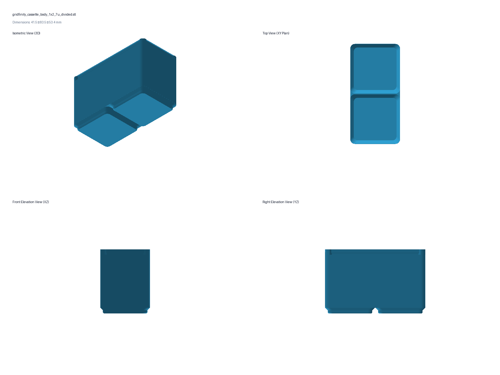
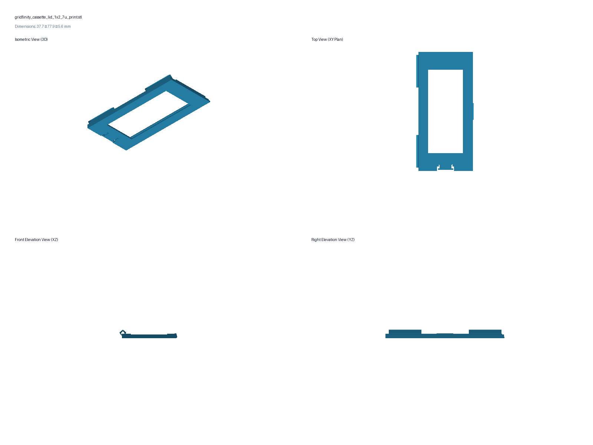
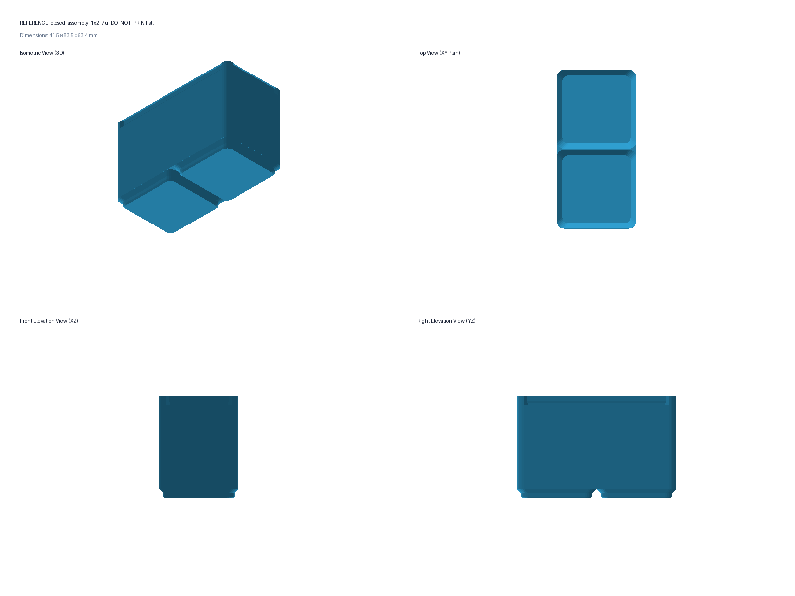
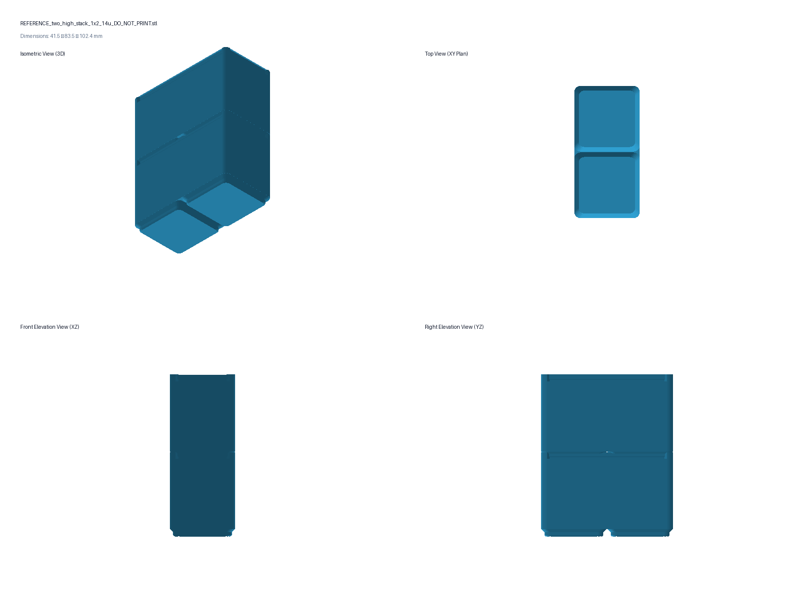

# Standalone 1x2 7U Gridfinity Cassette Bin (Plan 013)

This release implements a standalone **$1 \times 2$ Gridfinity-compatible cassette bin** at the standard **7U height** ($49.00\text{ mm}$ engaged shelf height, $53.40\text{ mm}$ total height with lip).
The body features a **monolithic standard Gridfinity stacking lip** on top, with an **inset internal lid rim** below the stacking shelf plane, allowing other standard Gridfinity bins to stack directly into the top of the body with zero contact on the lid or glass.

Two identical 7U bins stacked on top of each other measure **$102.40\text{ mm}$ total height**, fitting the measured **$111.125\text{ mm}$ inside drawer ceiling** with a generous **$+8.725\text{ mm}$ safety clearance margin**.

---

## Architectural Highlights

1. **Monolithic Standard Gridfinity Body (7U):**
   * **Base:** Two standard $42.0\text{ mm}$ base feet centered at $Y = \pm 21.0\text{ mm}$ ($35.6 \to 37.2 \to 41.5\text{ mm}$ stepped $45^\circ$ lead-in profile).
   * **Stacking Lip:** Monolithic $1 \times 2$ Gridfinity stacking lip ($+4.40\text{ mm}$ height, $41.5 \times 83.5\text{ mm}$ outer, $37.2 \times 79.2\text{ mm}$ throat, $r = 3.4\text{ mm}$) at the top of the body ($Z = 49.00\text{ to }53.40\text{ mm}$).
   * **Stacking Engagement:** Other Gridfinity bins stack directly into the body's stacking rim.
2. **Inset Internal Lid Shelf ($Z = 45.40\text{ mm}$):**
   * An internal perimeter ledge supports the lid below the stacking receiver features.
   * When closed, the lid top sits at **$Z = 48.60\text{ mm}$** (**$0.40\text{ mm}$ below the $Z = 49.00\text{ mm}$ stacking shelf plane**), fully isolating the glass and lid from stacked load.
3. **Inset Peaked 3-Knuckle Filament Hinge:**
   * Hinge knuckles are inset inside the left wall at $X = -17.20\text{ mm}$, $Z = 45.40\text{ mm}$, completely below the stacking shelf.
   * Uses a $1.75\text{ mm}$ printer filament pin (nominal bore $2.25\text{ mm}$ body, $2.10\text{ mm}$ lid with 21-point peaked profile).
4. **Squeeze-to-Release Closure Latch:**
   * An inward catch shelf ($0.60\text{ mm}$ undercut) is located on the inside center of the front long wall ($X = +18.75\text{ mm}$).
   * Squeezing the front long wall inward by $\approx 0.7\text{ mm}$ flexes the wall enough to disengage the lid hook and smoothly pop open.
5. **Replaceable Glass Microscope Slide Window:**
   * End-loaded $27.0 \times 1.4\text{ mm}$ slide channel accommodating standard microscope slides ($75 \times 25 \times 1.1\text{--}1.2\text{ mm}$).
   * Centered $23.0 \times 55.0\text{ mm}$ clear viewing window.
   * Reinforced $1.20\text{ mm}$ solid PETG compliant retention clip with $0.50\text{ mm}$ perimeter flexure gap.
6. **Symmetrical Dual 9 mm Label Bands:**
   * Symmetrical $34.0 \times 10.0\text{ mm}$ flat solid label zones on both ends for standard 9 mm Brother TZe tape.
7. **Ergonomics & Dividers:**
   * Smooth $R = 4.0\text{ mm}$ curved finger scoop along the inside bottom front floor.
   * Removable divider cards divide the cavity into 3 equal $25.0\text{ mm}$ compartments.

---

## 3D Multi-View Visuals

### 1. Divided Body 7U (Stacking Lip, Inset Shelf, Squeeze Catch)

### 2. Inset Lid (Print Orientation)

### 3. Closed Assembly (7U)

### 4. Two-High 14U Stack ($102.4\text{ mm}$ engaged height)

---

## Print Files in `build/`

- **`build/gridfinity_cassette_body_1x2_7u_divided.stl`** (divided body; print upright in PETG or ASA)
- **`build/gridfinity_cassette_body_1x2_7u.stl`** (undivided body; print upright in PETG or ASA)
- **`build/gridfinity_cassette_lid_1x2_7u_print.stl`** (inset lid; print top-face down in PETG with zero supports)
- **`build/divider_card_1x2_7u_1_2mm.stl`** (divider card; print flat in PETG)

*Do not print `REFERENCE_*.stl`.*

---

## Dimensional Summary

| Feature | Dimension |
|---|---:|
| Nominal Pitch Footprint | 1 × 2 Gridfinity (42.0 × 84.0 mm) |
| Outside Dimensions | 41.5 × 83.5 mm (r = 3.75 mm) |
| Engaged Stacking Shelf Height (7U) | 49.00 mm |
| Stacking Lip Height | 4.40 mm |
| Total Overall Bin Height | 53.40 mm |
| Inset Lid Shelf Plane | 45.40 mm |
| Closed Lid Top Plane | 48.60 mm (+0.40 mm clearance below stacking shelf) |
| Two Bins Stacked Total Height | 102.40 mm |
| Measured Drawer Clearance (111.125 mm ceiling) | +8.725 mm |
| Usable Internal Cavity Depth | 39.40 mm (floor Z = 6.00 to lid shelf) |
| Glass Microscope Slide Size | 75.0 × 25.0 × 1.1–1.2 mm |
| Clear Viewing Aperture | 23.0 × 55.0 mm |
| Symmetrical Label Bands | Two 34.0 × 10.0 mm zones for 9 mm TZe tape |
| Hinge Pin | Nominal 1.75 mm printer filament, cut to 74 mm |
| Latch Release Mechanism | Squeeze front long wall inward ~0.7 mm |
