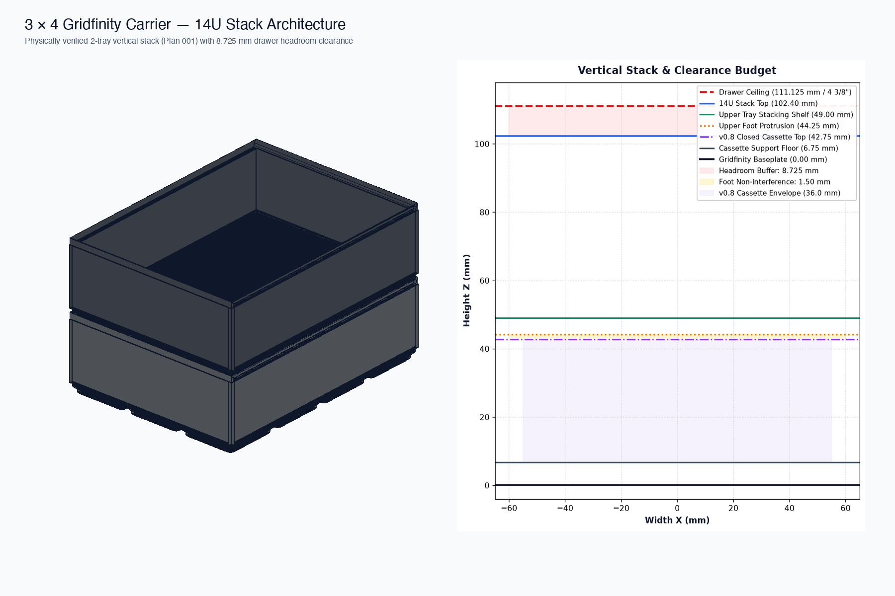
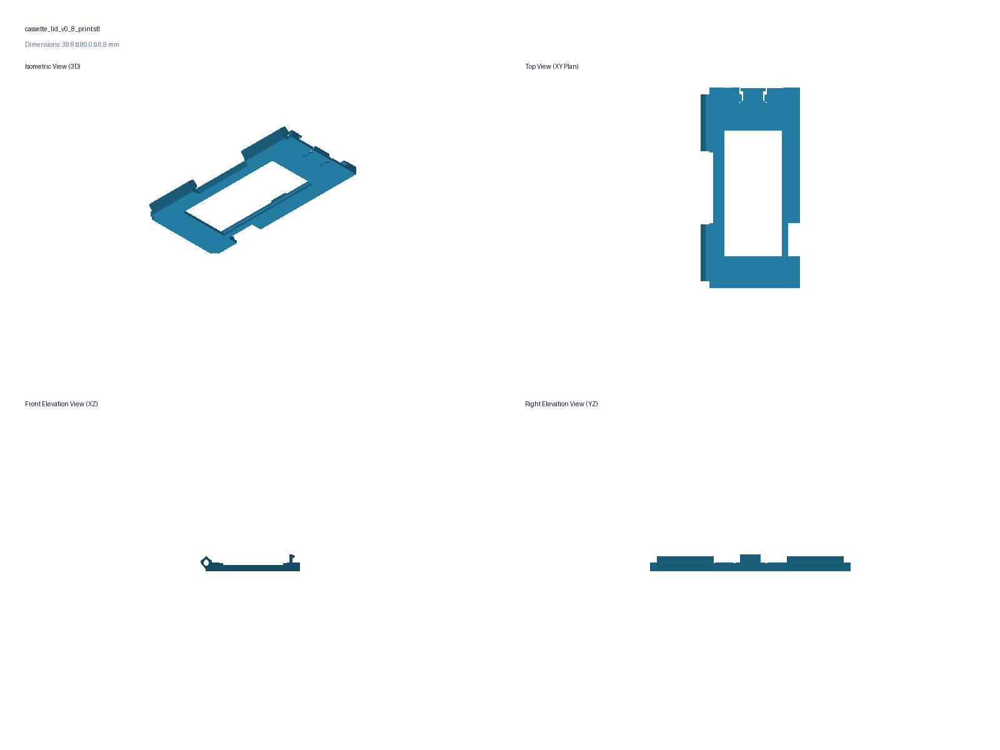
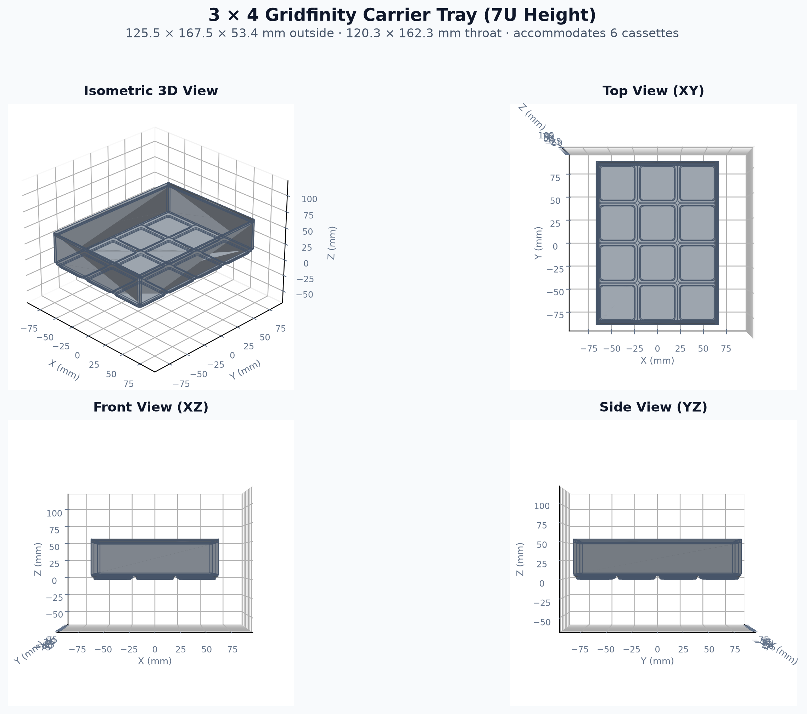
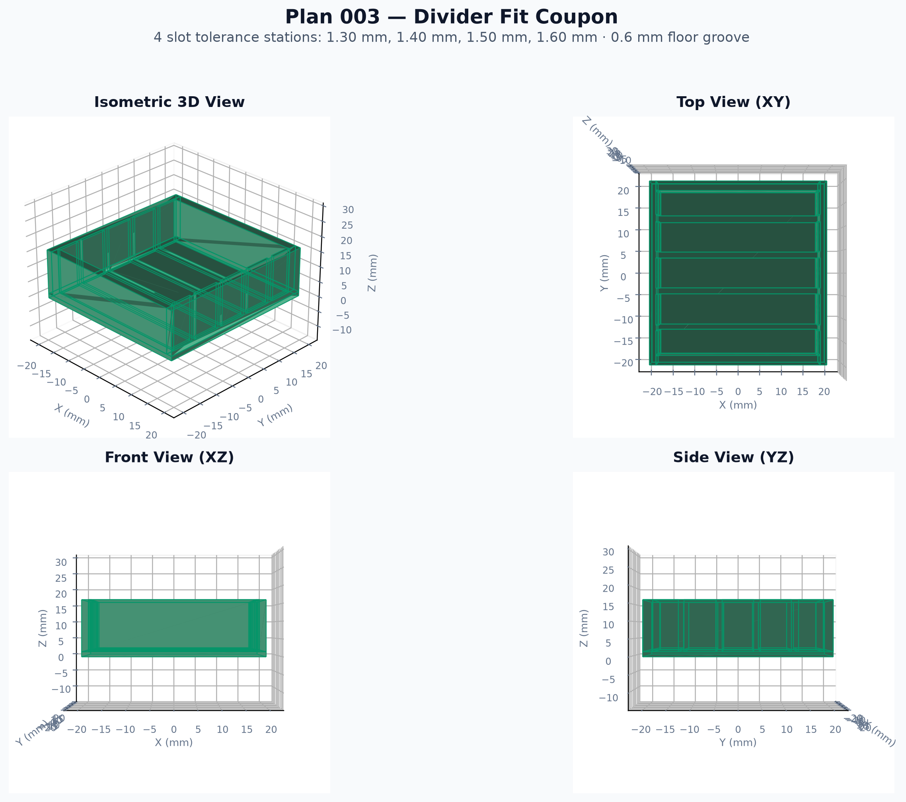

# Gridfinity Glass-Window Cassette System

This project is developing a durable, modular storage system for screws, nuts,
bolts, and other small hardware. Individually closed and labeled cassettes sit
inside stackable Gridfinity-compatible carrier trays, preventing the broad spill
failure of conventional open bins while keeping contents and approximate stock
levels visible through replaceable microscope-slide glass.

> [!WARNING]
> **AI-assisted development:** This project includes dimensions, code, geometry,
> documentation, and recommendations produced with assistance from generative
> AI. AI output can be incomplete, internally inconsistent, or geometrically
> wrong even when source calculations, previews, or mesh audits appear valid.
> Nothing in this repository is a certified engineering design or a substitute
> for independent review, slicer inspection, test prints, measurements, and
> real-world validation.
>
> Printed parts and glass can fail. Inspect every exported STL and sliced toolpath,
> reject chipped or forced glass, wear appropriate eye protection when handling
> or testing glass, and keep hands clear of sharp fragments. Do not rely on an
> unverified cassette or carrier to contain hazardous, valuable, food-contact,
> medical, electrical-safety-critical, or otherwise safety-critical contents.
> The person fabricating and using these parts is responsible for determining
> whether a particular revision, material, printer, and application are safe.

> [!CAUTION]
> **Active development:** This project is a work in progress. Dimensions,
> tolerances, interfaces, filenames, instructions, and compatibility may change
> at any time without notice as physical-test results become available. A part
> that fits one revision, material, printer, or slicer configuration may not fit
> another, and compatibility with future releases is not guaranteed unless it is
> explicitly documented.
>
> Before printing, record the exact Git commit and part version being used,
> review the matching README, manifest, and physical-test notes, and inspect the
> sliced toolpath. Print the supplied functional coupons and one complete sample
> before committing to a large batch. Do not mix revisions based only on similar
> appearance or filenames; use the documented compatibility rules. Keep known-
> good printed parts until their replacements have passed the same real-world
> tests, and expect failed or superseded prototypes during development.

## Project goals

- Keep every cassette individually closed when removed, handled, or tipped.
- Make contents and 9 mm Brother TZe labels visible from above in an open drawer.
- Use replaceable, mechanically retained microscope-slide glass rather than
  press-fit acrylic.
- Build a compatible family of cassette sizes on a consistent cassette sub-grid.
- Support optional removable dividers that form two or three equal compartments
  and minimize very-small-part transfer during rollover.
- Hold cassettes in loaded, stackable carriers using the standard 42 mm
  Gridfinity pitch, base, stacking interface, and 7 mm height increments.
- Fit practical loaded stacks below the measured drawer ceiling of
  **111.125 mm (4 3/8 in)**.
- Treat exported-STL audits and physical prints—not visual plausibility—as the
  authority for functional geometry.

## Human and AI Roles in Development

This project uses an iterative Human-in-the-Loop (HITL) engineering methodology. Responsibilities are clearly divided:

- **Human Collaborator:**
  - **Strategic Direction & Requirements:** Defines project goals, physical boundaries (e.g. drawer depth, glass sizes, hardware volumes), and prioritizes/approves plans.
  - **Fabrication & Machine Operation:** Manages slicer setup, material selection (PETG, ASA, PLA), print profiles, and printer execution.
  - **Ground-Truth Physical Validation:** Performs assembly, caliper measurements, tactile/ergonomic evaluation (grasp ease, latch tension), and real-world failure testing (stacking fit, rollover, drops).
  - **Authoritative Adjudication:** Physical observations are binding. When prints contradict CAD or mathematical models, the human's findings govern all redesigns.

- **AI Coding Agent:**
  - **Parametric CAD Generation:** Maintains editable Python mesh generators producing support-free printable STL files.
  - **Automated Geometry Auditing:** Audits STL meshes for 0 boundary edges, 0 non-manifold edges, finite coordinates, and shell connectivity.
  - **Tolerance Budgeting & Pipeline Management:** Tracks stack calculations, clearance budgets, and structured plans in `Plans/`.
  - **Continuous Documentation Integrity:** Reviews and updates all READMEs, manifests, and test notes with every commit.

## Current status — 2026-08-28

The 14U vertical carrier stack architecture has been **physically verified**
([Plan 001](Plans/Completed/2026-08-28-001-validate-14u-carrier-stack.md)): two 3 × 4 × 7U
carrier trays seat onto standard Gridfinity baseplates in the target drawer with ample
clearance below the 111.125 mm drawer ceiling.

The height-optimized cassette standard is **physically verified** as **v0.8**
([Plan 002](Plans/Completed/2026-08-28-002-optimize-cassette-and-carrier-height.md)):
closed envelope of **$39.55 \times 80.0 \times 36.0\text{ mm}$** (body height $32.80\text{ mm}$,
lid height $3.20\text{ mm}$), providing **$30.80\text{ mm}$ of usable internal depth**
(+35.1% capacity increase over the $28.0\text{ mm}$ baseline) and tested non-interference
clearance below the upper carrier tray's downward-protruding Gridfinity feet ($Z = 44.25\text{ mm}$).
The physically verified v0.7 lid, glass slide channel, 6.75 mm compliant PETG latch, and
3-knuckle filament hinge are 100% reusable.

The removable divider system is **physically verified**
([Plan 003](Plans/Completed/2026-08-28-003-develop-optional-cassette-dividers.md)):
$1.40\text{ mm}$ recessed side-wall channels and floor groove with a thickened $4.30\text{ mm}$
left wall providing $+0.65\text{ mm}$ unobstructed vertical drop-in clearance past the hinge knuckle,
and two stations at $Y = \pm 12.87\text{ mm}$ creating three equal $24.53\text{ mm}$ compartments.

The active in-work plan is **[Plan 004](Plans/004-finalize-smallest-cassette-and-carrier.md)**:
finalize the smallest cassette and six-cassette 3 × 4 carrier into a production release candidate
with dedicated grab/removal features and complete test prints.

## 3D System Architecture & Model Gallery

| Component 3D Drawing | Description |
|---|---|
|  | **v0.8 Cassette Body:** $38.6 \times 80.0 \times 32.8\text{ mm}$, $30.8\text{ mm}$ cavity depth, $2.0\text{ mm}$ floor. |
|  | **v0.8 / v0.7 Transverse Lid:** End-loaded $27.0 \times 1.4\text{ mm}$ channel, compliant PETG latch. |
|  | **3 × 4 × 7U Carrier:** Holds 6 modular cassettes with solid $2.6\text{ mm}$ walls. |
|  | **Plan 003 Removable Dividers:** $1.40\text{ mm}$ slot width, $0.60\text{ mm}$ wall/floor channels. |

## Current reference configuration

| Component | Current reference | Validation state |
|---|---|---|
| Optimized cassette | v0.8 ($39.55 \times 80.0 \times 36.0\text{ mm}$ closed; $32.8\text{ mm}$ body) | **Physically verified** (Plan 002 complete) |
| Removable dividers | $1.40\text{ mm}$ slot channels, $1.20\text{ mm}$ card, 3 equal compartments | **Physically verified** (Plan 003 complete) |
| Low-profile baseline | v0.7 ($39.55 \times 80.0 \times 28.0\text{ mm}$ closed; $24.8\text{ mm}$ body) | Physically verified; hinge, capture, clasp, and split line pass |
| Window | Plain slide glass, maximum intended 26.3 × 76.3 × 1.2 mm | Measure each delivered batch |
| Pane capture | End-loaded 27.0 × 1.4 mm channel; integral 6.75 mm PETG latch | Physically verified (Plan 009 complete) |
| Hinge pin | Straight 1.75 mm printer filament | Works well in the verified hinge pair |
| Reference carrier | 3 × 4 × 7U, six cassettes | **Physically verified** (Plan 001 complete) |
| Two-carrier stack | 14U, modeled 102.4 mm overall | **Physically verified** in target drawer (Plan 001 complete) |
| Drawer ceiling | 111.125 mm | Measured absolute ceiling |

## Development sequence

Multiple plans may be in work when their current steps are independent or one is
waiting for a physical print. Plan 004 is currently in work. Plans 005–008
are fully developed in [`Plans/Queued/`](Plans/Queued/) and cover larger cassettes,
mixed-layout carriers, durability/material testing, and the production baseline.

The authoritative queue order and its rationale exist only in
[`Plans/PRIORITIES.md`](Plans/PRIORITIES.md). Plans 001, 002, 003, and 009 are completed and
archived in [`Plans/Completed/`](Plans/Completed/). Next queued plan is Plan 005.

The active cassette release is available in
[`Cassettes/glass_slide_cassette_40x80/`](Cassettes/glass_slide_cassette_40x80/) as
`cassette_body_v0_8.stl` and `cassette_lid_v0_8_print.stl`.

New ideas belong in [IDEAS.md](IDEAS.md) and must remain under three sentences.
See the [plan pipeline](Plans/README.md) for promotion, execution, Git checkpoint,
validation, and dated archive rules.

## Repository map

- [`AGENTS.md`](AGENTS.md) — binding dimensions, physical findings, validation
  rules, compatibility history, and repository working agreements.
- [`Cassettes/`](Cassettes/) — cassette generators, printable releases,
  manifests, previews, and assembly references.
- [`Carriers/`](Carriers/) — carrier generators, printable tests, manifests,
  previews, and physical-test records.
- [`Plans/`](Plans/) — in-work plans, the prioritized queue, templates, checker,
  and completed-plan archive.
- [`IDEAS.md`](IDEAS.md) — concise unprocessed project ideas.

## Working rules

- Read this README, `AGENTS.md`, the active plan, relevant release README and
  manifest, and the latest physical-test notes before changing geometry.
- Print exact functional coupons before committing material to complete parts.
- Never scale parts in the slicer to correct tolerances; change named source
  dimensions and release a new version.
- Preserve tested history through Git. A working release directory may replace
  old generated artifacts after a checkpoint when the user explicitly chooses
  Git rather than parallel copies as the revision store.
- Keep modeled, printed, and physically verified claims clearly separated.
- Treat all AI-assisted output as unverified until independently reviewed and
  validated against the actual exported artifact and physical print.
- Record the exact revision before printing, validate one sample before a batch,
  and do not assume compatibility between versions unless it is documented.
- Before completing a plan, reconcile every required project and release
  document listed in `AGENTS.md`, then archive the plan with its walkthrough.

## License

This project is available under the [MIT License](LICENSE). The license's
software warranty disclaimer supplements, and does not replace, the AI-use,
glass-handling, print-validation, and physical-safety warning above.
