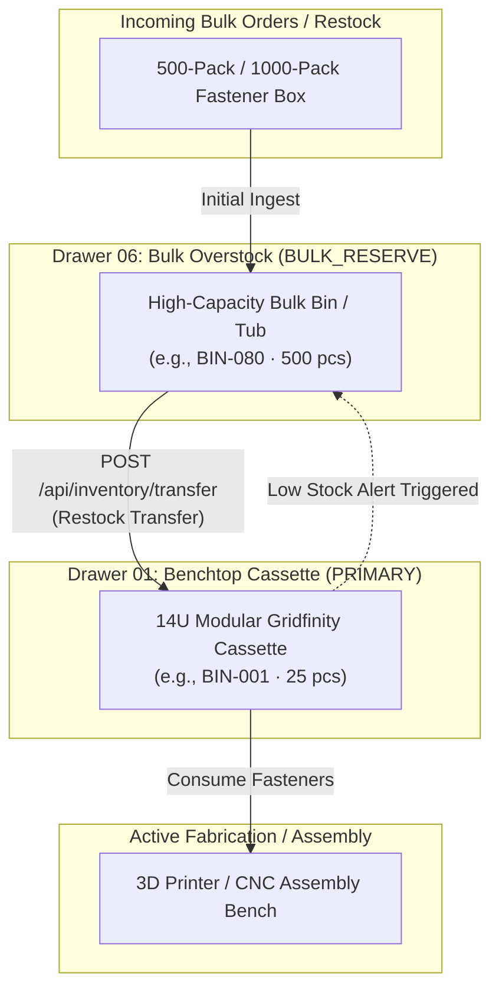

# Multi-Location Inventory Allocation & Bulk Overstock Management

## 1. Overview & Storage Philosophy

The **Parts-Database** workshop inventory platform supports tiered physical storage architectures. High-frequency assembly workflows demand immediate accessibility at the workbench, whereas large bulk orders (such as 500-pack or 1000-pack fastener boxes) occupy significant physical volume that should not consume prime benchtop real estate.

To solve this, inventory is partitioned across two primary operational tiers:



---

## 2. Storage Roles & Tiers

Each physical compartment in the database is tagged with an operational `storage_role`:

| Storage Role | Typical Location | Description | Restock Behavior |
| :--- | :--- | :--- | :--- |
| **`PRIMARY`** | Benchtop Gridfinity Drawers (`DRAWER-01`) | Fast-access modular slide cassette bins immediately within arm's reach. | Generates low-stock replenishment alert when $Q \le \text{reorder\_threshold}$. |
| **`BULK_RESERVE`** | Deep Workshop Drawers (`DRAWER-06`) | High-capacity bulk tubs, original manufacturer packaging, or deep storage bins. | Acts as replenishment source for `PRIMARY` bins. |
| **`OVERFLOW`** | Auxiliary Storage Shelves / Staging | Overflow inventory when bulk capacity is exceeded or staging for upcoming builds. | Acts as secondary replenishment source. |

---

## 3. Inventory Aggregation & Technical Views

When browsing the Fastener Catalog or viewing an individual part's specifications:

1. **Total Stock on Hand**: $Q_{\text{total}} = Q_{\text{primary}} + Q_{\text{bulk}} + Q_{\text{overflow}}$
2. **Primary Working Stock**: $Q_{\text{primary}} = \sum_{c \in \text{PRIMARY}} c.q$
3. **Bulk Reserve Stock**: $Q_{\text{bulk}} = \sum_{c \in \text{BULK\_RESERVE}} c.q$

### API Representation (`GET /api/parts/{part_id}`)
```json
{
  "id": "M3-12mm-SHCS",
  "name": "M3 × 12 mm Socket Head Cap Screw",
  "primary_quantity": 25,
  "bulk_quantity": 480,
  "total_quantity": 505,
  "compartments": [
    {
      "id": "BIN-002-C1",
      "bin_id": "BIN-002",
      "storage_role": "PRIMARY",
      "quantity_on_hand": 25,
      "reorder_threshold": 10,
      "location_name": "Modular Fastener Drawer 01",
      "location_tier": "PRIMARY_BENCH"
    },
    {
      "id": "BIN-081-C1",
      "bin_id": "BIN-081",
      "storage_role": "BULK_RESERVE",
      "quantity_on_hand": 480,
      "reorder_threshold": 50,
      "location_name": "Deep Storage Drawer 06",
      "location_tier": "BULK_OVERSTOCK"
    }
  ]
}
```

---

## 4. Atomic Stock Transfer Workflow

When primary benchtop inventory runs low, technicians can transfer stock from bulk storage into the primary cassette without manual math:

### API Endpoint: `POST /api/inventory/transfer`

**Request Payload**:
```json
{
  "from_compartment_id": "BIN-081-C1",
  "to_compartment_id": "BIN-002-C1",
  "quantity": 25,
  "reason": "Restock primary bench bin from bulk overstock"
}
```

**Validation Rules**:
1. **Quantity Gating**: $Q_{\text{transfer}} > 0$.
2. **Source Balance Gating**: $Q_{\text{source}} \ge Q_{\text{transfer}}$.
3. **Part Compatibility**: `from_comp.part_id` must match `to_comp.part_id` (or target compartment must be unassigned, in which case the part assignment is inherited).
4. **Audit Logging**: Every transfer is permanently committed to `stock_transfer_logs` with a unique UUID, timestamp, and reason.

---

## 5. Automated Replenishment Alerts

The dashboard monitors all `PRIMARY` compartments in real-time. When a compartment falls below its `reorder_threshold` and there exists stock in a `BULK_RESERVE` or `OVERFLOW` compartment for the same part, a **Restock Required** alert card is displayed on the dashboard:

- **Endpoint**: `GET /api/inventory/replenish-alerts`
- **Dashboard Widget**: Lists low primary bins alongside available bulk source locations and provides a 1-click **Restock →** shortcut to execute the transfer.
