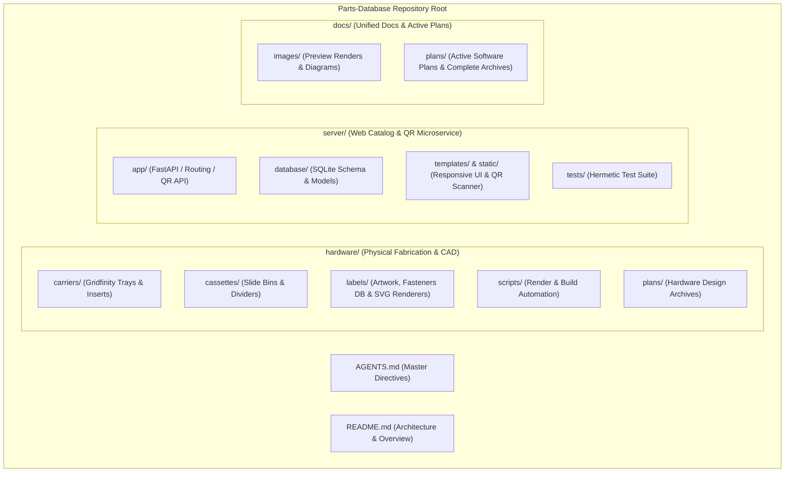

# Plan 01: Repository Categorization, Directory Restructuring & Web Catalog Server Staging

## 1. Goal Description

The `Parts-Database` repository currently houses both mechanical 3D print assets (carriers, cassettes, labels, render scripts) at the root level and is preparing to introduce a modern Web Catalog Server & QR Scanner microservice.

This plan executes a clean, structured repository reorganization:
1. Group all physical 3D fabrication models, parametric generators, and label artwork into a dedicated **`hardware/`** directory (`hardware/carriers/`, `hardware/cassettes/`, `hardware/labels/`, `hardware/scripts/`, `hardware/plans/`).
2. Scaffold the dedicated **`server/`** directory (`server/app/`, `server/database/`, `server/static/`, `server/templates/`, `server/tests/`) for the upcoming web catalog server.
3. Update all documentation, generator scripts, and internal relative links to preserve 100% link portability and build integrity.

---

## 2. Architecture & Directory Hierarchy Diagram



---

## 3. Code & File Modifications

### Component 1: Hardware Category Migration
- **`[NEW / MOVE]`** `Carriers/` $
ightarrow$ `hardware/carriers/`
- **`[NEW / MOVE]`** `Cassettes/` $
ightarrow$ `hardware/cassettes/`
- **`[NEW / MOVE]`** `Labels/` $
ightarrow$ `hardware/labels/`
- **`[NEW / MOVE]`** `scripts/` $
ightarrow$ `hardware/scripts/`
- **`[NEW / MOVE]`** `Plans/` $
ightarrow$ `hardware/plans/`

### Component 2: Script & Generator Path Updates
- **`[MODIFY]`** `hardware/scripts/generate_all_renders.py`: Update paths referencing `Carriers/`, `Cassettes/`, and `Labels/` to `hardware/...`.
- **`[MODIFY]`** `hardware/labels/generate_labels.py`: Update default output directory to `hardware/labels/build`.

### Component 3: Server Directory Scaffolding
- **`[NEW]`** `server/`: Scaffold `app/`, `database/`, `static/`, `templates/`, and `tests/` directories with `.gitkeep` markers.

### Component 4: Documentation Link Synchronization
- **`[MODIFY]`** [`README.md`](../README.md): Update directory structure reference table and component links.
- **`[MODIFY]`** [`AGENTS.md`](../AGENTS.md): Update hardware CAD generation rules and paths.

---

## 4. Test Updates & Specifications

1. **Link & Security Audits**:
   - Run `tests/test_documentation_links.py` and `tests/test_security_auditor.py` across workspace to ensure zero broken links.
2. **Hardware Generator Verification**:
   - Verify `python3 hardware/labels/generate_labels.py` runs and locates `hardware/labels/data/fasteners.json`.

---

## 5. Documentation Updates

- **`[MODIFY]`** [`README.md`](../README.md): Document `hardware/` and `server/` root architecture.
- **`[MODIFY]`** [`AGENTS.md`](../AGENTS.md): Update path invariants.

---

## 6. Verification Plan

### Automated Verification
```bash
# 1. Run workspace relative link and security tests
.venv/bin/python -m pytest tests/test_documentation_links.py tests/test_security_auditor.py -q

# 2. Verify label generation script locates data files
python3 hardware/labels/generate_labels.py --help
```

### Manual Verification
1. Inspect directory structure via `ls -la` and `tree -L 2`.
2. Confirm clean separation between `hardware/`, `server/`, and `docs/`.
