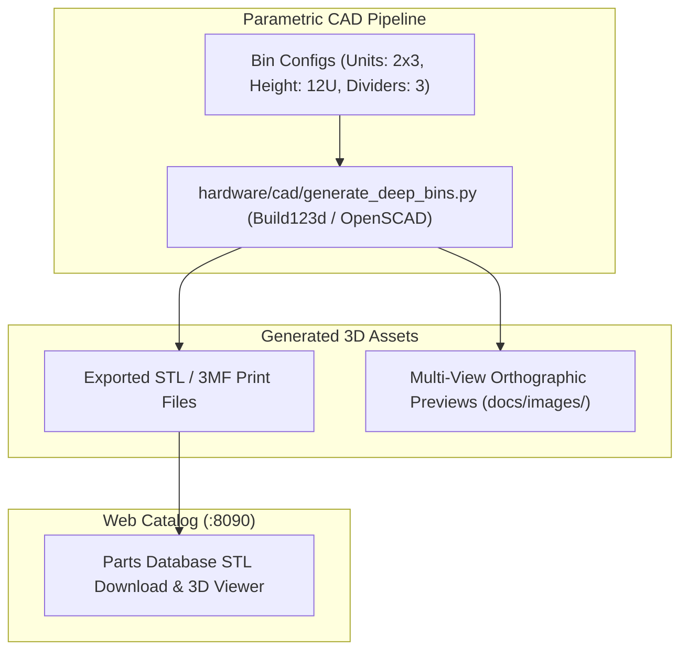

# Plan H01: Mixed-Layout Gridfinity Carriers & Deep Bin Cassettes

## 1. Goal Description
While standard 1x1, 1x2, and 2x2 Gridfinity bins hold standard M2–M4 screws, larger hardware (M8+ structural bolts, long screws > 50mm, and mixed fastener kits) requires deeper bin cassettes and custom multi-compartment carriers.
This plan expands the 3D parametric CAD generator pipeline:
1. **Parametric OpenSCAD / Build123d Models**: Create parametric models for 2x2, 2x3, and 3x3 deep Gridfinity carriers with reinforced ribs and magnet pockets.
2. **Divided & Mixed Compartment Cassettes**: Support 1/2/3/4 compartment divided cassettes with removable slide lids.
3. **Automated STL & Render Generation**: Integrate into `hardware/scripts/generate_all_renders.py` for automated vector previews and 3D print file generation.

---

## 2. Architecture & Workflow Diagram



---

## 3. Code Modifications

### Hardware CAD & Automation Scripts
- `[NEW]` `hardware/cad/generate_deep_bins.py`: Parametric Build123d script generating deep 2x2 and 3x3 Gridfinity carriers and slide-lid cassettes.
- `[MODIFY]` [`hardware/scripts/generate_all_renders.py`](../../hardware/scripts/generate_all_renders.py): Add build targets for large cassettes and carriers.
- `[MODIFY]` [`server/app/templates/catalog.html`](../../server/app/templates/catalog.html): Link 3D STL download buttons for large bins.

### Tests
- `[NEW]` `hardware/tests/test_cad_generation.py`: Unit tests asserting non-empty STL generation and valid geometric bounding boxes.

---

## 4. Test Updates & Specifications

### Test Harness (`hardware/tests/test_cad_generation.py`)
1. **`test_parametric_bin_generation()`**:
   - Executes `generate_deep_bins.py` with test dimensions (2x2, 12U).
   - Asserts generated STL file size > 50KB and mesh bounding box equals $(84\text{mm} \times 84\text{mm} \times 84\text{mm} \pm 0.5\text{mm})$.

---

## 5. Documentation Updates
- `[MODIFY]` [`Parts-Database/README.md`](../README.md): Document new hardware carrier specs and print recommendations (PETG / PLA).
- `[MODIFY]` [`Parts-Database/docs/plans/AGENTS.md`](AGENTS.md): Register Plan H01.

---

## 6. Verification Plan

### Automated Tests:
```bash
./run_tests.sh
```

### Manual Verification:
1. Run `python3 hardware/cad/generate_deep_bins.py --preview`.
2. Inspect exported STL in slicer (PrusaSlicer / Bambu Studio / Cura) to verify base Gridfinity mesh fit and wall thicknesses.
