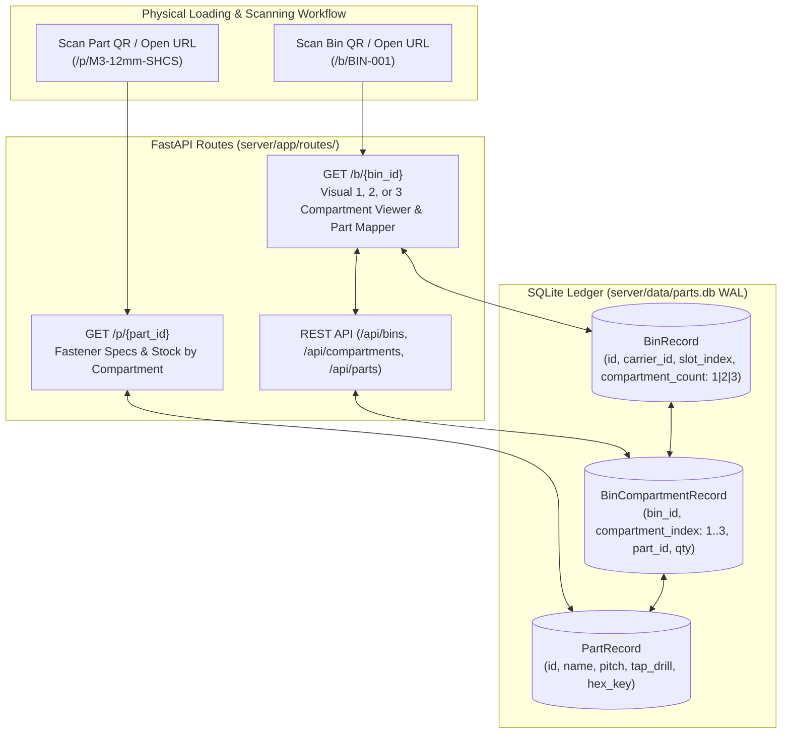

# Plan M02: Cross-Subsystem URL Linkages & Dynamic 1/2/3-Compartment Bin Management

---

## 1. Goal Description

Physical small parts storage cassettes are fabricated with **1, 2, or 3 compartments** (single bulk, 2-way divided, or 3-way divided). 

As physical 3D printing and bin loading proceeds in the workshop, this plan establishes the complete **relational data model and web URL routing linkages** so that incoming physical bin assignments and future QR scans resolve cleanly:
1. **Bin Cassette Landing & Assignment Route (`/b/{bin_id}`)**:
   - Identifies the physical cassette bin (`BIN-001`, `BIN-002`, etc.) and its 1, 2, or 3 internal compartments.
   - Shows physical location (carrier tray and slot) and the parts currently assigned to each compartment.
   - Provides a web UI to assign, reassign, or configure fastener parts as bins are physically loaded.
2. **Part Tech Specs Route (`/p/{part_id}`)**:
   - Displays fastener specifications (pitch, tap drill, clearance drill, drive wrench size, material) and lists every physical bin and compartment where that part is stored, with one-tap stock counters.
3. **Multi-Compartment Relational Schema**:
   - `BinRecord`: `id` (e.g. `BIN-001`), `carrier_id`, `slot_index`, `compartment_count` (1, 2, or 3), `cassette_type` (`single`, `divided_2`, `divided_3`), `updated_at`.
   - `BinCompartmentRecord`: `id`, `bin_id` (FK), `compartment_index` (1, 2, or 3), `part_id` (FK, nullable), `quantity_on_hand`, `reorder_threshold`, `notes`.
4. **REST API Endpoints**:
   - `GET /api/bins/{bin_id}`: Returns bin structure and all 1, 2, or 3 compartments with assigned parts.
   - `POST /api/bins/{bin_id}/compartments`: Update or assign part IDs to specific compartment slots.
   - `PATCH /api/compartments/{comp_id}/quantity`: Adjust stock quantity for an individual compartment.
   - `GET /api/parts/{part_id}`: Returns part tech specs and list of containing bins.

*(Note: Physical label SVG sheet generation for bin spine QR stickers and part labels will be run in a subsequent step when requested by the user).*

---

## 2. Architecture & Workflow Diagram



---

## 3. Code Modifications

### Component 1: Multi-Compartment Relational Schema & Seed Engine (`server/app/`)
- **`[MODIFY]`** `server/app/models.py`:
  - Update `BinRecord` with `compartment_count` (1, 2, or 3) and `cassette_type` (`single`, `divided_2`, `divided_3`).
  - Add `BinCompartmentRecord` model linking `bin_id` to `compartment_index` (1, 2, or 3), nullable `part_id`, `quantity_on_hand`, and `reorder_threshold`.
  - Update `PartRecord` with relationship to `BinCompartmentRecord`.
- **`[MODIFY]`** `server/app/seed.py`:
  - Update seed generator to instantiate physical numbered bins (`BIN-001` through `BIN-024`) across 1, 2, and 3-compartment cassette types with baseline part mappings.

### Component 2: Dedicated Part & Multi-Compartment Bin Web Views (`server/`)
- **`[MODIFY]`** `server/app/routes/views.py`:
  - Add `GET /p/{part_id}` view returning fastener technical specs, tap drill charts, and containing bins.
  - Update `GET /b/{bin_id}` view with responsive 1, 2, or 3-compartment visual layout and dynamic part mapper.
- **`[NEW]`** `server/templates/part_detail.html`: Mobile-friendly fastener technical spec view with compartment stock breakdown.
- **`[MODIFY]`** `server/templates/bin_detail.html`: Visual cassette layout for 1, 2, or 3 compartments with part assignment dropdowns and quick quantity adjusters.
- **`[MODIFY]`** `server/templates/parts.html`: Link parts directly to `/p/{part_id}`.

### Component 3: REST API Endpoints (`server/app/routes/api.py`)
- **`[MODIFY]`** `server/app/routes/api.py`:
  - `POST /api/bins/{bin_id}/compartments`: Update part assignment for compartment 1, 2, or 3.
  - `PATCH /api/compartments/{comp_id}/quantity`: Increment/decrement or set stock for a specific compartment.
  - `GET /api/parts/{part_id}`: Return part tech specs and list of all containing bins/compartments.

---

## 4. Test Updates & Specifications

- **File**: `server/tests/test_compartments_and_routes.py` (`[NEW]`)
  - **`test_1_2_3_compartment_bin_creation`**: Verifies bins can be configured with 1, 2, or 3 compartments.
  - **`test_dynamic_compartment_part_reassignment`**: Verifies assigning/swapping parts in compartment 2 updates database state.
  - **`test_compartment_quantity_adjustment`**: Verifies `PATCH /api/compartments/{id}/quantity` updates stock accurately.
  - **`test_part_detail_spec_view`**: Verifies `GET /p/{part_id}` returns HTTP 200 with tap drill and containing bins.
  - **`test_bin_detail_compartment_view`**: Verifies `GET /b/{bin_id}` renders 1, 2, or 3 compartments.

---

## 5. Documentation Updates

- **`[MODIFY]`** [`Parts-Database/README.md`](../README.md): Document 1/2/3-compartment cassette model, `/b/{bin_id}` bin management route, and `/p/{part_id}` part tech spec route.
- **`[MODIFY]`** [`Parts-Database/AGENTS.md`](../AGENTS.md): Document multi-compartment SQLite schema and REST API endpoints.

---

## 6. Verification Plan

### Automated Tests
```bash
# 1. Run server test suite including compartment and route tests
cd server && PYTHONPATH=".." .venv/bin/python -m pytest tests/ -v

# 2. Run workspace link and security audits
.venv/bin/python -m pytest tests/test_documentation_links.py tests/test_security_auditor.py -q
```

### Manual Verification
1. Open [http://localhost:8090/b/BIN-001](http://localhost:8090/b/BIN-001) in browser and verify 1-compartment layout.
2. Open [http://localhost:8090/b/BIN-007](http://localhost:8090/b/BIN-007) and verify 2-compartment layout with part assignment dropdown.
3. Open [http://localhost:8090/b/BIN-013](http://localhost:8090/b/BIN-013) and verify 3-compartment layout.
4. Open [http://localhost:8090/p/M3-12mm-SHCS](http://localhost:8090/p/M3-12mm-SHCS) and verify technical specs and containing bins.
