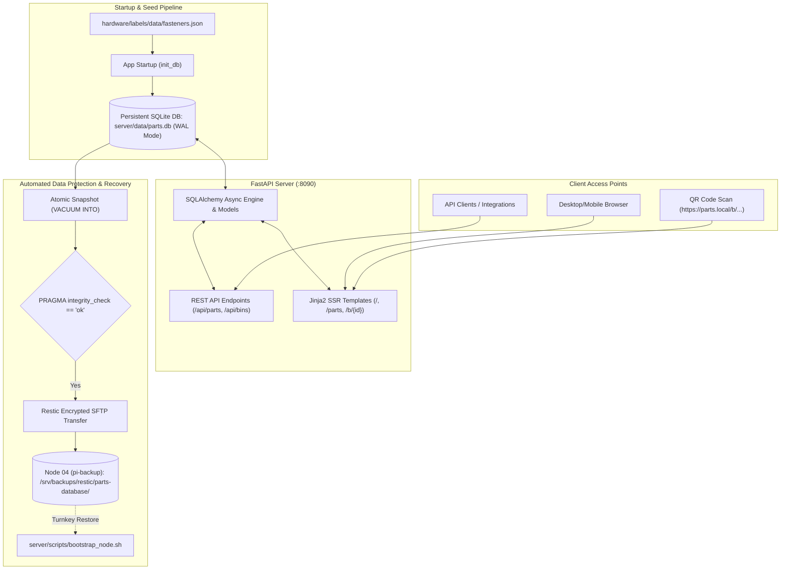

# Plan S01: FastAPI Web Catalog Server, SQLite Parts Database & Automated Backup Pipeline

---

## 1. Goal Description

With `Parts-Database` restructured into `hardware/` and `server/`, the goal of this plan is to stand up the complete **Web Catalog Server & SQLite Inventory Microservice** in `server/`, fully adhering to the master workspace backup and bare-metal recovery standards.

Key objectives:
1. **Isolated Python Environment & Tooling**: Setup isolated `.venv/`, `requirements.txt`, and entry scripts for `server/`.
2. **Persistent SQLite Ledger & Ingestion**:
   - Build async SQLite storage with WAL mode (`parts.db`) using SQLAlchemy.
   - Define relational models for `Category`, `Part`, `StorageLocation`, `Carrier`, and `Bin`.
   - Implement an automated seed ingester on startup that translates `hardware/labels/data/fasteners.json` into relational parts.
3. **REST API & Responsive Web Catalog**:
   - REST endpoints: `GET /api/parts`, `GET /api/parts/{id}`, `GET /api/bins`, `GET /api/bins/{id}`, `PATCH /api/bins/{id}/quantity`, `GET /api/categories`.
   - Clean, modern, responsive Jinja2/Tailwind UI:
     - `/`: Unified Dashboard with inventory statistics, category pills, and quick search.
     - `/parts`: Full-text searchable fastener database with thread specs and tap drills.
     - `/b/{bin_id}`: Dedicated mobile-optimized Bin landing page for QR scans showing current stock and fast quantity adjusters.
4. **Master Rack Automated Backup & Turnkey Disaster Recovery Architecture**:
   - Build `server/scripts/backup_parts.sh` performing zero-downtime atomic snapshots (`VACUUM INTO`), verifying `PRAGMA integrity_check`, and pushing encrypted restic snapshots to Node 04 (`pi-backup.local:/srv/backups/restic/parts-database`) with 14 daily, 8 weekly, 12 monthly retention pruning.
   - Build `server/scripts/bootstrap_node.sh` for automated turnkey node provisioning and bare-metal recovery.
   - Author `server/docs/BACKUP_AND_RECOVERY.md` documenting emergency recovery drills.
5. **Hermetic Test Suite**:
   - Pytest suite covering database schema creation, startup seed ingestion, REST API endpoints, quantity adjustments, HTML template rendering, and backup snapshot integrity verification.

---

## 2. Architecture & Workflow Diagram



---

## 3. Code Modifications

### Component 1: Environment & Dependency Manifests
- **`[NEW]`** `server/requirements.txt`: FastAPI, Uvicorn, SQLAlchemy, aiosqlite, Jinja2, python-multipart, pytest, pytest-asyncio, httpx, anyio.
- **`[NEW]`** `server/run.sh`: Automated launcher binding to `0.0.0.0:8090`.

### Component 2: Database Schema & Seed Engine
- **`[NEW]`** `server/app/database.py`: Async engine factory, WAL configuration, and session management.
- **`[NEW]`** `server/app/models.py`: Declarative ORM models (`CategoryRecord`, `PartRecord`, `StorageLocationRecord`, `CarrierRecord`, `BinRecord`).
- **`[NEW]`** `server/app/seed.py`: Parser that reads `hardware/labels/data/fasteners.json` and seeds categories, parts, sample storage locations, and bins.

### Component 3: FastAPI Application & Endpoints
- **`[NEW]`** `server/app/main.py`: FastAPI app initialization, lifespan startup/shutdown hooks, static file mounting, template configuration.
- **`[NEW]`** `server/app/routes/api.py`: JSON REST API routes.
- **`[NEW]`** `server/app/routes/views.py`: Server-rendered HTML dashboard, parts catalog, and `/b/{bin_id}` scan detail view.

### Component 4: Responsive UI Templates & Static Assets
- **`[NEW]`** `server/templates/base.html`: Modern layout with Tailwind CSS CDN, header, navigation, and mobile drawer.
- **`[NEW]`** `server/templates/dashboard.html`: Inventory overview, category cards, and recent items.
- **`[NEW]`** `server/templates/parts.html`: Interactive fastener catalog with real-time search, filters, tap drills, and hex key sizes.
- **`[NEW]`** `server/templates/bin_detail.html`: Clean mobile-friendly QR landing page with one-tap stock decrement/increment.

### Component 5: Data Protection, Backup & Disaster Recovery
- **`[NEW]`** `server/scripts/backup_parts.sh`: Daily atomic SQLite `VACUUM INTO` backup script with Restic encryption to Node 04 (`pi-backup`).
- **`[NEW]`** `server/scripts/bootstrap_node.sh`: Turnkey bare-metal node provisioner and automated restore script.
- **`[NEW]`** `server/docs/BACKUP_AND_RECOVERY.md`: Runbook for manual disaster recovery, restic snapshots, and database integrity validation.

---

## 4. Test Updates & Specifications

- **File**: `server/tests/test_server_api.py` (`[NEW]`)
  - **`test_db_initialization_and_seed`**: Verifies that `init_db()` populates all 7 fastener categories and baseline parts from `fasteners.json`.
  - **`test_api_get_parts_and_filtering`**: Verifies `GET /api/parts` returns JSON list with search filter support.
  - **`test_api_get_part_detail`**: Verifies `GET /api/parts/{part_id}` returns thread specs, tap drill, and tool size.
  - **`test_bin_quantity_patch`**: Verifies `PATCH /api/bins/{bin_id}/quantity` increments/decrements inventory correctly.
  - **`test_html_view_rendering`**: Verifies `GET /`, `GET /parts`, and `GET /b/{bin_id}` return HTTP 200 with rendered HTML.

- **File**: `server/tests/test_backup_pipeline.py` (`[NEW]`)
  - **`test_atomic_vacuum_into_integrity`**: Verifies SQLite WAL mode `VACUUM INTO` produces a healthy standalone database passing `PRAGMA integrity_check`.
  - **`test_corrupt_database_detection`**: Verifies corrupted snapshot detection logic blocks bad backups.
  - **`test_retention_policy_pruning`**: Verifies Restic pruning parameters (14D / 8W / 12M).

---

## 5. Documentation Updates

- **`[MODIFY]`** [`README.md`](../README.md): Document Web Catalog server runtime, port (`:8090`), setup instructions, API endpoints, and backup schedule.
- **`[MODIFY]`** [`AGENTS.md`](../AGENTS.md): Document server conventions, database paths, API schemas, and Node 04 backup landing zones.
- **`[MODIFY]`** [`rack/06_backup_strategy_master.md`](../../rack/06_backup_strategy_master.md): Register Parts-Database landing zone table.

---

## 6. Verification Plan

### Automated Tests
```bash
# 1. Run hermetic server and backup test suite
cd server && .venv/bin/python -m pytest tests/ -v

# 2. Run documentation link and security checks
.venv/bin/python -m pytest tests/test_documentation_links.py tests/test_security_auditor.py -q
```

### Manual Verification
1. Start server with `./server/run.sh` or `.venv/bin/python -m uvicorn server.app.main:app --port 8090`.
2. Open [http://localhost:8090/](http://localhost:8090/) in browser and verify inventory metrics and category counts.
3. Open [http://localhost:8090/parts](http://localhost:8090/parts) and search for `"M3"` or `"Heat-Set"`.
4. Open [http://localhost:8090/b/sample_bin_m3_12](http://localhost:8090/b/sample_bin_m3_12) and test clicking + / - quantity buttons.
5. Execute `server/scripts/backup_parts.sh --dry-run` and verify atomic `VACUUM INTO` snapshot passes integrity check.
