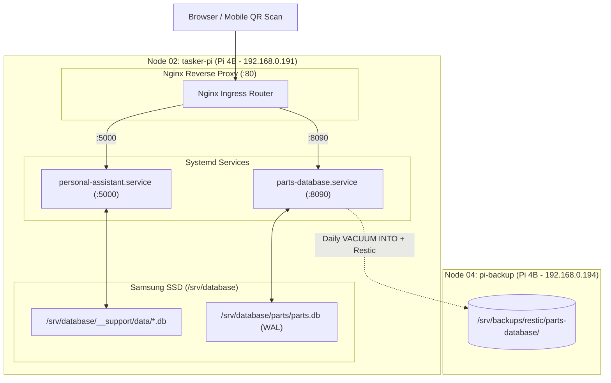

# Plan S02: Production Deployment & Provisioning on Node 02 (tasker-pi)

---

## 1. Goal Description

Deploy the **Parts-Database Web Catalog & Inventory Microservice** to **Node 02 (`tasker-pi`, Pi 4B)** co-located alongside Personal-Assistant on port `:8090`.

Key objectives:
1. **Persistent SSD Database Storage**: Configure persistent database storage at `/srv/database/parts/parts.db` on the external Samsung SSD mounted on Node 02, ensuring high write endurance and fast SQLite WAL transactions.
2. **Turnkey Node Deployment Scripts**:
   - Update `server/scripts/bootstrap_node.sh` and `server/scripts/backup_parts.sh` with Node 02 parameters (`/srv/database/parts/`, `tasker-pi.local`, user `detour`).
   - Include Nginx site reverse proxy configuration template (`server/config/nginx-parts.conf`) for `tasker-pi`.
3. **Automated Daily Backup Integration**:
   - Schedule daily atomic `VACUUM INTO` snapshots to Node 04 (`pi-backup.local:/srv/backups/restic/parts-database/`) at 03:00 AM with 14D / 8W / 12M retention.
4. **Rack & Documentation Reconciliation**:
   - Update `rack/01_physical_layout_and_hardware.md`, `rack/06_backup_strategy_master.md`, `Parts-Database/README.md`, and master `AGENTS.md` registering Node 02 as the production host.
5. **Hermetic Test Suite**:
   - Verify all tests pass with the SSD storage path resolution and configuration templates.

---

## 2. Architecture & Workflow Diagram



---

## 3. Code Modifications

### Component 1: Node 02 Configuration & Provisioning Scripts (`server/`)
- **`[MODIFY]`** `server/scripts/bootstrap_node.sh`:
  - Set SSD database path to `/srv/database/parts/parts.db`.
  - Create `/srv/database/parts` directory with `detour:www-data` ownership.
  - Configure `parts-database.service` systemd unit binding to port `8090`.
- **`[MODIFY]`** `server/scripts/backup_parts.sh`:
  - Dynamically resolve database path from `/srv/database/parts/parts.db` or local data directory.
- **`[NEW]`** `server/config/nginx-parts.conf`:
  - Nginx reverse proxy configuration for Node 02.
- **`[MODIFY]`** `server/app/database.py`:
  - Check for `/srv/database/parts/parts.db` on boot, falling back to local `server/data/parts.db`.

### Component 2: Master Rack Architecture & Operations Documentation
- **`[MODIFY]`** [`Parts-Database/README.md`](../../README.md): Document Node 02 (`tasker-pi`) production deployment, SSD path, port 8090, and systemd unit.
- **`[MODIFY]`** [`Parts-Database/AGENTS.md`](../../AGENTS.md): Update production runtime specifications.
- **`[MODIFY]`** [`rack/06_backup_strategy_master.md`](../../../rack/06_backup_strategy_master.md): Update Parts-Database host to Node 02 (`tasker-pi`).
- **`[MODIFY]`** [`AGENTS.md`](../../../AGENTS.md): Update rack architecture topology table.

---

## 4. Test Updates & Specifications

- **File**: `server/tests/test_backup_pipeline.py` (`[MODIFY]`)
  - Verify dynamic SSD path detection and fallback resolution.
- **File**: `server/tests/test_server_api.py` (`[MODIFY]`)
  - Verify database initialization with custom and fallback paths.

---

## 5. Documentation Updates

- **`[MODIFY]`** [`Parts-Database/README.md`](../../README.md)
- **`[MODIFY]`** [`Parts-Database/AGENTS.md`](../../AGENTS.md)
- **`[MODIFY]`** [`rack/06_backup_strategy_master.md`](../../../rack/06_backup_strategy_master.md)
- **`[MODIFY]`** [`AGENTS.md`](../../../AGENTS.md)

---

## 6. Verification Plan

### Automated Tests
```bash
# 1. Run server test suite
cd server && PYTHONPATH=".." .venv/bin/python -m pytest tests/ -v

# 2. Run documentation link and security checks
.venv/bin/python -m pytest tests/test_documentation_links.py tests/test_security_auditor.py -q
```

### Manual Verification
1. Inspect `server/scripts/bootstrap_node.sh` and `server/scripts/backup_parts.sh` for exact Node 02 parameters.
2. Run `server/scripts/backup_parts.sh --dry-run` and verify successful snapshot capture.
