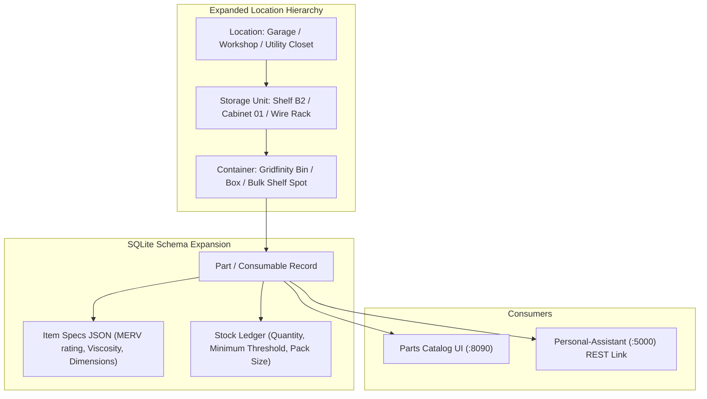

# Plan S03: Household Consumables & Fleet Maintenance Inventory Expansion

## 1. Goal Description
The `Parts-Database` schema is currently optimized for small fasteners in modular Gridfinity bins. To support whole-home and estate operations, the system needs to expand to track larger household maintenance consumables (HVAC air filters, water filters, LED light bulbs, lawnmower blades) and automotive fleet parts (motor oil, oil filters, spark plugs, fluids) stored across various locations (garage shelves, utility closets, basement racks).
This plan:
1. Expands `server/app/models.py` to support hierarchical storage locations (`Shelf`, `Cabinet`, `Bin`, `Rack`, `Slot`) and multi-pack item quantities.
2. Adds structured specification attributes (e.g. `16x25x1 MERV 11`, `5W-30 Full Synthetic`, `E26 2700K 60W`).
3. Introduces low-stock reorder thresholds and REST endpoints for external consumers (such as `Personal-Assistant`).

---

## 2. Architecture & Workflow Diagram



---

## 3. Code Modifications

### Backend Server & Models
- `[MODIFY]` [`server/app/models.py`](../../server/app/models.py): Add `LocationHierarchy`, `ItemCategory` (Fastener, HVAC, Fleet, Plumbing, Electrical), `item_attributes` JSON field, and `reorder_threshold`.
- `[MODIFY]` [`server/app/database.py`](../../server/app/database.py): Add schema migration for new location and category columns.
- `[MODIFY]` [`server/app/main.py`](../../server/app/main.py): Add `/api/parts/search` and `/api/parts/{part_id}/decrement` endpoints.
- `[MODIFY]` [`server/templates/parts.html`](../../server/templates/parts.html): Add category filters (Hardware, HVAC, Fleet, Electrical) and location hierarchy breadcrumbs.

### Tests
- `[NEW]` `server/tests/test_consumables_inventory.py`: Automated tests verifying location hierarchy creation, attribute queries, reorder threshold alerts, and stock decrements.

---

## 4. Test Updates & Specifications

### Test Harness (`server/tests/test_consumables_inventory.py`)
1. **`test_create_consumable_with_hierarchy_location()`**:
   - Creates an HVAC filter record with location `"Utility Room > Shelf 2 > Rack A"`, specs `{"size": "16x25x1", "merv": 11}`, quantity 4, reorder threshold 2.
   - Asserts record persists and queries return correct hierarchy path.
2. **`test_stock_decrement_below_threshold_flags_reorder()`**:
   - Decrements stock from 2 to 1. Asserts `is_low_stock` boolean evaluates to True.

---

## 5. Documentation Updates
- `[MODIFY]` [`Parts-Database/README.md`](../../README.md): Document expanded taxonomy and API specifications.
- `[MODIFY]` [`Parts-Database/docs/plans/AGENTS.md`](AGENTS.md): Register Plan S03.

---

## 6. Verification Plan

### Automated Tests:
```bash
./run_tests.sh
```

### Manual Verification:
1. Open catalog web UI (`:8090/catalog`).
2. Add a new fleet oil filter item with location `Garage Shelf 1`.
3. Filter catalog by `Fleet` category and verify item appears with location breadcrumb.
