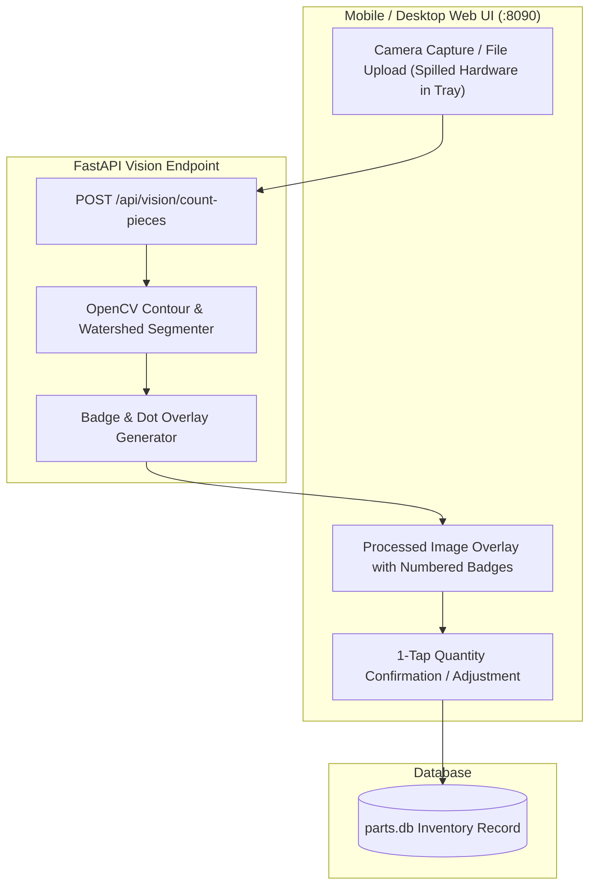

# Plan S04: Computer Vision Camera Fastener Counter (Snapshot Piece Counting)

## 1. Goal Description
Counting small screws, nuts, and washers manually by hand is tedious and prone to human error, while scale-based weighing is often inaccurate for lightweight hardware.
This plan implements an automated **Computer Vision Fastener Counter**:
1. **Camera Snapshot Capture**: In the restock/inventory web UI (`:8090/restock`), provide an integrated camera capture / image upload modal.
2. **Computer Vision Contour Segmentation**: Process the image using OpenCV contour detection and circular Hough transforms / watershed segmentation to identify distinct hardware pieces on high-contrast backgrounds (tray or bin bottom).
3. **Interactive Validation Overlay**: Display the processed image back to the user with numbered dot markers and bounding boxes, showing the calculated count (e.g. "Detected: 48 pieces") with quick +/- manual override buttons before saving the count to `parts.db`.

---

## 2. Architecture & Workflow Diagram



---

## 3. Code Modifications

### Vision Modules & Backend API
- `[NEW]` `server/app/vision_counter.py`: OpenCV-based image preprocessor (grayscale, adaptive thresholding, morphological opening, watershed segmentation, and contour counting) returning detected count and annotated JPEG overlay.
- `[MODIFY]` [`server/app/main.py`](../../server/app/main.py): Add `POST /api/vision/count-pieces` multipart image upload endpoint.
- `[NEW]` `server/app/templates/vision_counter.html`: Touch-optimized mobile camera capture interface with interactive count confirmation.

### Tests
- `[NEW]` `server/tests/test_vision_counter.py`: Automated tests asserting piece detection accuracy on synthetic fastener test images (5, 20, 50 simulated fastener circles) and API error handling.

---

## 4. Test Updates & Specifications

### Test Harness (`server/tests/test_vision_counter.py`)
1. **`test_cv_fastener_detection_synthetic_image()`**:
   - Generates a synthetic test image with 25 distinct white circles on a dark background.
   - Runs `count_fasteners(image_bytes)`. Asserts returned count equals 25 ($\pm 1$).
2. **`test_vision_count_api_endpoint()`**:
   - Posts synthetic image to `/api/vision/count-pieces`. Asserts JSON response includes `count`, `confidence`, and `annotated_image_base64`.

---

## 5. Documentation Updates
- `[MODIFY]` [`Parts-Database/README.md`](../../README.md): Document camera piece-counter instructions and lighting tips for best accuracy.
- `[MODIFY]` [`Parts-Database/docs/plans/AGENTS.md`](AGENTS.md): Register Plan S04.

---

## 6. Verification Plan

### Automated Tests:
```bash
./run_tests.sh
```

### Manual Verification:
1. Open `:8090/restock` on a phone browser.
2. Spill a handful of screws onto a white sheet or tray, take a snapshot.
3. Verify detected piece count and dot overlay match actual items.
