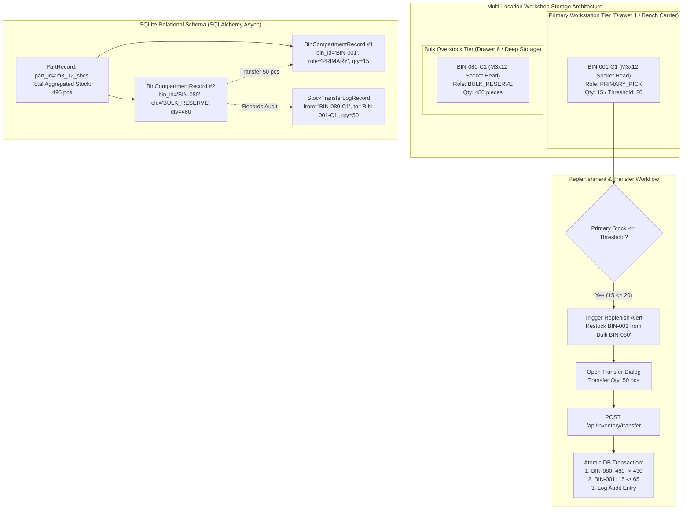

# Plan S06: Multi-Location Inventory Allocation, Bulk Overstock Storage & Transfer Management

## 1. Goal Description

### Context & Problem Statement
In workshop hardware and fastener management, parts are frequently purchased in bulk quantities (e.g. 100-pack or 500-pack boxes of M3x12 screws or heat-set inserts). Keeping full bulk containers in active benchtop Gridfinity trays wastes valuable primary drawer real estate and causes cassette crowding.

The standard organizational pattern is **tiered multi-location storage**:
1. **Primary Workstation Bins (`PRIMARY_PICK`)**: A usable working quantity (e.g. 20–50 pieces) resides in the most accessible, high-traffic modular Gridfinity carrier directly above or next to the workbench (e.g. Workbench Drawer 1).
2. **Bulk Overstock & Deep Storage (`BULK_RESERVE`)**: The bulk remainder (e.g. 450 pieces) is stored in a larger cassette, deep bin, or bulk hardware tub in a secondary, less accessible drawer, back cabinet, or overhead shelf (e.g. Deep Storage Drawer 6).

While `Parts-Database` supports linking a `part_id` to multiple `BinCompartmentRecord` rows, the system currently lacks:
- Explicit storage tier classification (`PRIMARY_PICK` vs `BULK_RESERVE` vs `OVERFLOW`).
- Combined multi-location stock rollups and tier breakdowns in the catalog views.
- Automatic replenishment alerts when primary benchtop stock drops below reorder thresholds while bulk overstock exists.
- An atomic, 1-click or scan-to-transfer inventory movement workflow (`POST /api/inventory/transfer`) with auditable transfer logging (`StockTransferLogRecord`).

### Objectives
1. **Model Storage Tiering & Compartment Roles**: Enhance [`server/app/models.py`](../../server/app/models.py) with storage roles (`PRIMARY`, `BULK_RESERVE`, `OVERFLOW`), location tiering, and an auditable `StockTransferLogRecord`.
2. **Atomic Inventory Transfer API**: Implement `POST /api/inventory/transfer` and `GET /api/inventory/replenish-alerts` in [`server/app/routes/api.py`](../../server/app/routes/api.py).
3. **Multi-Location Catalog & Part Detail Views**: Update [`server/app/routes/views.py`](../../server/app/routes/views.py) and templates ([`part_detail.html`](../../server/templates/part_detail.html), [`parts.html`](../../server/templates/parts.html), [`dashboard.html`](../../server/templates/dashboard.html)) to display multi-tier location breakdowns (e.g. `25x Primary [BIN-001-C1] + 500x Bulk [BIN-080-C1] = 525x Total`) with interactive "Transfer from Bulk to Primary" restock modals.
4. **Hermetic Test Suite**: Add comprehensive unit tests in `server/tests/test_multi_location_inventory.py` verifying multi-location aggregation, transfer atomicity, insufficient stock validation, and replenishment alerts.
5. **Documentation**: Create `server/docs/MULTI_LOCATION_STORAGE.md` covering multi-tier organization, bin replenishment, and transfer mechanics.

---

## 2. Architecture & Workflow Diagram



---

## 3. Code Modifications

### 1. Database Schema & Data Models
- `[MODIFY]` [`server/app/models.py`](../../server/app/models.py):
  - Add `storage_role: Mapped[str] = mapped_column(String(32), nullable=False, default="PRIMARY")` (`PRIMARY`, `BULK_RESERVE`, `OVERFLOW`, `SECONDARY`) to `BinCompartmentRecord`.
  - Add `tier: Mapped[str] = mapped_column(String(32), nullable=False, default="PRIMARY_BENCH")` (`PRIMARY_BENCH`, `SECONDARY_DRAWER`, `BULK_OVERSTOCK`, `DEEP_STORAGE`) to `StorageLocationRecord`.
  - Add `StockTransferLogRecord(Base)`:
    - `id`: `String(64)` primary key (UUID / timestamped ID).
    - `part_id`: `String(64)` foreign key to `parts.id`.
    - `from_compartment_id`: `String(64)` foreign key to `bin_compartments.id`.
    - `to_compartment_id`: `String(64)` foreign key to `bin_compartments.id`.
    - `quantity`: `Integer` (positive integer moved).
    - `reason`: `Optional[str]` (e.g. "Restock primary bin", "Manual adjustment").
    - `created_at`: `DateTime` timestamp.

### 2. REST API Endpoints
- `[MODIFY]` [`server/app/routes/api.py`](../../server/app/routes/api.py):
  - `POST /api/inventory/transfer`:
    - Payload: `{"from_compartment_id": str, "to_compartment_id": str, "quantity": int, "reason": Optional[str]}`.
    - Validates both compartments hold the same `part_id`.
    - Validates source compartment has `quantity_on_hand >= quantity`.
    - Executes atomic decrement of source, increment of destination, and inserts `StockTransferLogRecord`.
  - `GET /api/inventory/replenish-alerts`:
    - Queries all `PRIMARY` compartments where `quantity_on_hand <= reorder_threshold` and at least one corresponding `BULK_RESERVE` compartment exists with `quantity_on_hand > 0`.
    - Returns actionable list of restock opportunities with source/dest bin IDs and recommended transfer amounts.
  - `POST /api/compartments/{compartment_id}/role`:
    - Updates storage role (`PRIMARY` vs `BULK_RESERVE`).

### 3. Web Catalog Views & UI Templates
- `[MODIFY]` [`server/app/routes/views.py`](../../server/app/routes/views.py):
  - Update `part_detail_view` (`/p/{part_id}`) to compute:
    - `primary_stock`: sum of `PRIMARY` compartments.
    - `bulk_stock`: sum of `BULK_RESERVE` and `OVERFLOW` compartments.
    - `total_stock`: sum of all compartments.
    - `replenish_sources`: list of bulk compartments available for quick restock.
  - Update `parts_catalog_view` (`/parts`) to aggregate total stock across all locations and render multi-location badges.
  - Update `dashboard_view` (`/`) to include a "Restock Needed from Bulk" alert card.
- `[MODIFY]` [`server/templates/part_detail.html`](../../server/templates/part_detail.html):
  - Group storage locations by tier: **Primary Workstation Bins** vs **Bulk Overstock & Deep Storage**.
  - Add interactive "Transfer from Bulk to Primary" 1-click modal / button.
  - Add visual status pill: `🟢 Stocked (Primary: 45x | Bulk: 500x)` or `🟡 Primary Low (Restock Available from Drawer 6)`.
- `[MODIFY]` [`server/templates/parts.html`](../../server/templates/parts.html):
  - Display multi-location breakdown in the parts table (`45x Primary / 500x Bulk`).
- `[MODIFY]` [`server/templates/dashboard.html`](../../server/templates/dashboard.html):
  - Add "Replenish from Bulk Overstock" quick-action widget.
- `[MODIFY]` [`server/templates/bin_detail.html`](../../server/templates/bin_detail.html):
  - Allow toggling compartment role (`Primary Pick` vs `Bulk Overstock`).

### 4. Database Seed Data
- `[MODIFY]` [`server/app/seed.py`](../../server/app/seed.py):
  - Add deep storage location (`LOC-DRAWER-06`, "Deep Storage Drawer 6", type `BULK_OVERSTOCK`).
  - Add bulk carrier and bulk bin (`BIN-080`, 1-compartment, `BULK_RESERVE`) storing overstock for common fasteners (`M3x8mm`, `M3x12mm`, `M4x16mm`).

---

## 4. Test Updates & Specifications

### 1. `server/tests/test_multi_location_inventory.py` `[NEW]`
- `test_part_multi_location_aggregation()`: Verifies that a part with stock in both a primary bench bin and bulk storage bin correctly reports isolated primary, bulk, and combined total quantities.
- `test_compartment_storage_roles()`: Verifies setting and updating storage roles (`PRIMARY` vs `BULK_RESERVE`) on compartments.
- `test_atomic_inventory_transfer_success()`: Verifies transferring stock from bulk compartment to primary compartment decrements source, increments target, and logs audit record.
- `test_atomic_inventory_transfer_insufficient_stock()`: Verifies transfer is rejected with HTTP 400 when requested quantity exceeds source stock.
- `test_atomic_inventory_transfer_part_mismatch()`: Verifies transfer is rejected when source and target compartments contain different part IDs.
- `test_replenishment_alert_trigger()`: Verifies `GET /api/inventory/replenish-alerts` detects low primary bins with available bulk overstock.
- `test_part_detail_multi_location_context()`: Verifies `/p/{part_id}` view context includes primary/bulk stock breakdowns and replenishment sources.

---

## 5. Documentation Updates

### 1. `server/docs/MULTI_LOCATION_STORAGE.md` `[NEW]`
- Document multi-tier storage philosophy (benchtop Gridfinity pick bins vs deep storage bulk tubs).
- Detail the bin-to-bin restock transfer workflow, role configuration, and low-stock replenishment alerts.

---

## 6. Verification Plan

### Automated Tests
```bash
./run_tests.sh
```
All test suites across `Parts-Database` must pass 100%.

### Manual Verification
1. Launch Parts-Database web server:
   ```bash
   .venv/bin/python -m uvicorn server.app.main:app --port 8090 --reload
   ```
2. Open `http://localhost:8090/parts` in browser:
   - Confirm parts stored in multiple locations show multi-tier badges (e.g. `25x Primary | 500x Bulk`).
3. Click on a multi-location part (e.g. `/p/m3_12_shcs`):
   - Confirm both Primary Bench Bin (`BIN-001-C1`) and Bulk Reserve Bin (`BIN-080-C1`) appear in separate tier sections.
   - Click "Restock Primary (Transfer from Bulk)", specify 25 pieces, and submit.
   - Confirm live update: Primary stock increases by 25, Bulk stock decreases by 25, Total remains constant.
4. Verify `/` Dashboard displays the "Restock Needed from Bulk" alert card when primary stock is low.
