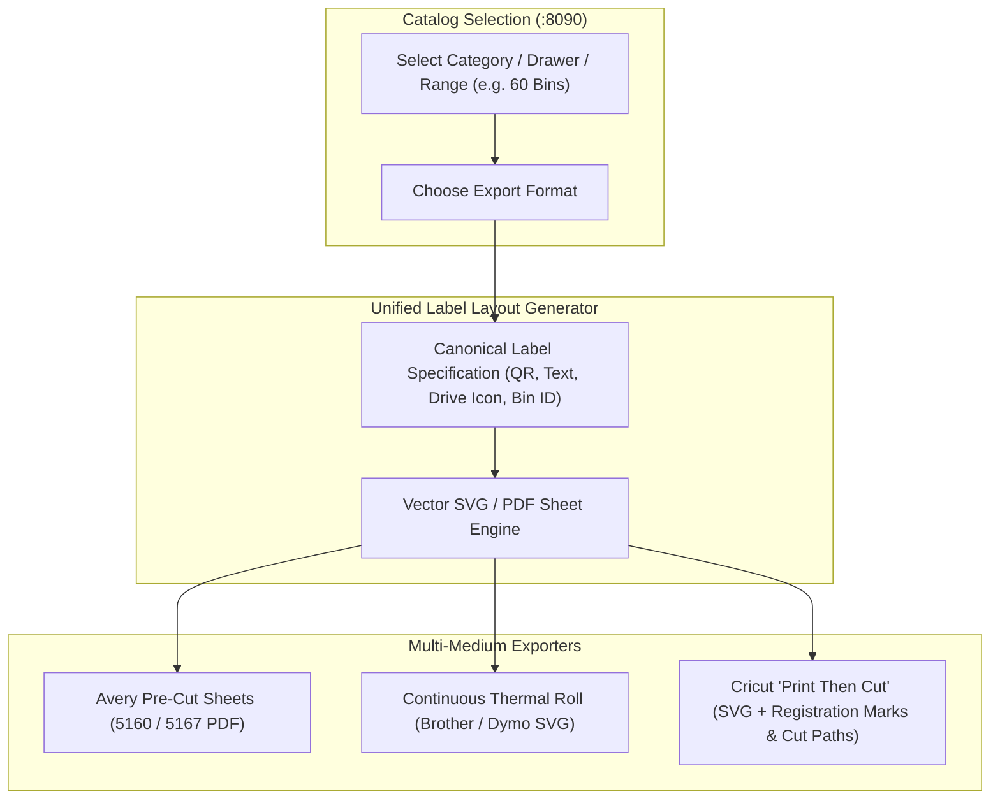

# Plan S05: Standardized Batch Label Sheet Generator & Cricut Print-Then-Cut Exporter

## 1. Goal Description
Labeling hundreds of hardware bins and storage shelves requires batch multi-up sheet generation. Regardless of the physical output medium (pre-cut adhesive sheets, continuous thermal tape, or uncut sticker paper), the visual format must strictly adhere to a **Unified Standard Label Specification**.
This plan implements:
1. **Canonical Label Specification**: Standardized high-contrast layout containing QR code, human-readable part description, thread size/pitch, drive/head icon, and bin coordinate ID.
2. **Multi-Source Export Engine**:
   - **Pre-cut Label Sheets**: Standard Avery templates (e.g. Avery 5160 30-up, Avery 5167 80-up).
   - **Continuous Thermal Rolls**: Brother QL / Dymo continuous streams.
   - **Cricut "Print Then Cut"**: Multi-up full-sheet SVG/PDF with standardized sensor registration marks and precision cut-boundary vector paths for automated kiss-cutting on uncut vinyl/sticker paper.
3. **Batch Export Web UI**: Select drawers, categories, or bin ranges and export print-ready files with 1 click.

---

## 2. Architecture & Workflow Diagram



---

## 3. Code Modifications

### Label Generators & Services
- `[MODIFY]` [`hardware/labels/generate_labels.py`](../../../hardware/labels/generate_labels.py): Refactor to enforce canonical label layout across all format exporters.
- `[NEW]` `hardware/labels/canonical_label.py`: Canonical label data structure and vector SVG renderer with QR code matrix and drive/head silhouettes.
- `[NEW]` `hardware/labels/cricut_exporter.py`: Cricut Print-Then-Cut generator creating SVG with exact boundary cut paths and corner optical registration sensor marks.
- `[NEW]` `hardware/labels/avery_templates.py`: Grid layout definitions and SVG composer for Avery 5160 (30-up), Avery 5167 (80-up), and custom multi-up letter sheets.
- `[NEW]` `hardware/labels/thermal_exporter.py`: Continuous thermal roll stream exporter (Brother / Dymo format).
- `[NEW]` `server/app/services/label_service.py`: Service layer mapping catalog database records (`PartRecord`, `BinRecord`) to label models and format exporters.

### API, Views & Web UI
- `[MODIFY]` [`server/app/routes/api.py`](../../../server/app/routes/api.py): Add `/api/labels/export-batch` accepting part IDs, category filter, and target format (`cricut_print_cut`, `avery_5160`, `avery_5167`, `thermal_roll`).
- `[MODIFY]` [`server/app/routes/views.py`](../../../server/app/routes/views.py): Add `/labels` route rendering batch label export view.
- `[NEW]` `server/templates/label_batch_export.html`: Interactive web interface for selecting parts/categories, live SVG preview, and 1-click downloads.
- `[MODIFY]` [`server/templates/base.html`](../../../server/templates/base.html): Add navigation link to `Labels`.

### Tests
- `[NEW]` `server/tests/test_batch_label_generator.py`: Automated hermetic tests verifying vector QR generation, SVG dimensions, Avery grids, Cricut cut paths, API endpoints, and view rendering.

---

## 4. Test Updates & Specifications

### Test Harness (`server/tests/test_batch_label_generator.py`)
1. **`test_canonical_label_layout_content()`**:
   - Asserts generated label contains part title, thread spec, drive icon, bin ID, and valid scannable QR code matrix.
2. **`test_cricut_print_then_cut_svg_structure()`**:
   - Generates a multi-label Cricut sheet. Asserts SVG contains exact 34x10mm cut paths, +1.0mm bleed print layer, and registration sensor bounding box.
3. **`test_avery_5160_grid_alignment()`**:
   - Verifies 30 labels fit within 3 columns $\times$ 10 rows on an 8.5" $\times$ 11" page with standard Avery 5160 margins and gap spacing.
4. **`test_avery_5167_grid_alignment()`**:
   - Verifies 80 labels fit within 4 columns $\times$ 20 rows on an 8.5" $\times$ 11" page with standard Avery 5167 micro-label margins.
5. **`test_thermal_roll_export()`**:
   - Verifies continuous thermal stream generation.
6. **`test_api_export_batch_endpoints()`**:
   - Asserts `POST /api/labels/export-batch` and `GET /api/labels/export-batch` return valid SVG attachments for all 4 formats.
7. **`test_label_batch_export_view()`**:
   - Asserts `GET /labels` renders HTTP 200 with parts list and selection filters.

---

## 5. Documentation Updates
- `[MODIFY]` [`hardware/labels/README.md`](../../../hardware/labels/README.md): Document Cricut Print-Then-Cut workflow, Avery alignment calibration, and canonical layout standards.
- `[MODIFY]` [`Parts-Database/docs/plans/AGENTS.md`](../AGENTS.md): Register Plan S05.

---

## 6. Verification Plan

### Automated Tests:
```bash
./run_tests.sh
```

### Manual Verification:
1. Open `:8090/labels` in the web catalog.
2. Select "M3 Socket Head Assortment (15 items)".
3. Export as Cricut Print-Then-Cut SVG; import into Cricut Design Space and verify printable artwork and cut lines separate onto appropriate layers.
