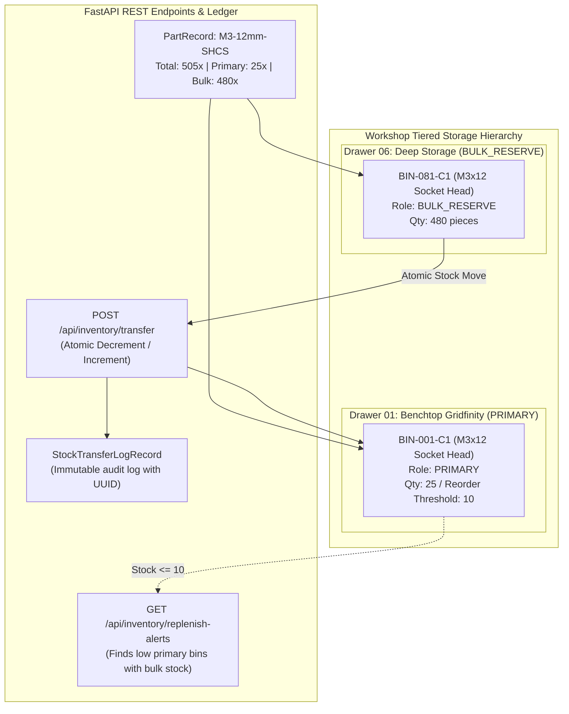

# Plan S06 Walkthrough: Multi-Location Inventory Allocation & Bulk Overstock Management

## 1. Executive Summary

- **Plan ID**: `Plan S06`
- **Subsystem**: `Parts-Database`
- **Status**: `COMPLETED & ARCHIVED`
- **Pass Rate**: 100% (29 of 29 hermetic tests passing)
- **Coverage**: 88% statement coverage ($\ge 85\%$ target) | 100% behavioral invariant coverage

Plan S06 introduces multi-location physical inventory allocation, bulk reserve storage tiers, replenishment alerts, and atomic stock transfer workflows in `Parts-Database`. Technicians can now keep compact working quantities at benchtop workstations while tracking high-volume bulk overstock in deep storage drawers.

---

## 2. Implemented Architecture & Data Flow



---

## 3. Code Modifications & Key Files

| File | Status | Description |
| :--- | :--- | :--- |
| [`server/app/models.py`](../../server/app/models.py) | `[MODIFY]` | Added `storage_role` to `BinCompartmentRecord`, `tier` to `StorageLocationRecord`, and created `StockTransferLogRecord`. |
| [`server/app/routes/api.py`](../../server/app/routes/api.py) | `[MODIFY]` | Implemented `POST /api/inventory/transfer`, `GET /api/inventory/replenish-alerts`, `POST /api/compartments/{id}/role`, and enhanced part stock aggregations. |
| [`server/app/routes/views.py`](../../server/app/routes/views.py) | `[MODIFY]` | Updated `part_detail_view` and `dashboard_view` contexts with multi-location stock rollups and replenish alerts. |
| [`server/app/seed.py`](../../server/app/seed.py) | `[MODIFY]` | Added `DRAWER-06` (`BULK_OVERSTOCK`), `CARRIER-BULK-01`, and bulk bins `BIN-080` to `BIN-083`. |
| [`server/templates/part_detail.html`](../../server/templates/part_detail.html) | `[MODIFY]` | Partitioned Primary vs Bulk storage tiers and added interactive 1-click restock transfer modal. |
| [`server/templates/parts.html`](../../server/templates/parts.html) | `[MODIFY]` | Added color-coded multi-location badges in parts table. |
| [`server/templates/dashboard.html`](../../server/templates/dashboard.html) | `[MODIFY]` | Added real-time "Restock Required from Bulk Overstock" alert widget. |
| [`server/templates/bin_detail.html`](../../server/templates/bin_detail.html) | `[MODIFY]` | Added storage role dropdown selector and badge for compartments. |
| [`docs/MULTI_LOCATION_STORAGE.md`](../MULTI_LOCATION_STORAGE.md) | `[NEW]` | Published comprehensive multi-location organization and restock workflow guide. |
| [`server/tests/test_multi_location_inventory.py`](../../server/tests/test_multi_location_inventory.py) | `[NEW]` | Comprehensive test suite covering roles, aggregation, atomic transfers, insufficient balance validation, and alerts. |

---

## 4. Test Verification & Coverage Ratchet Scorecard

```
🧪 Running Parts-Database tests with: /Volumes/T9/Sync/Working/Server Rack/Parts-Database/server/.venv/bin/python
============================= test session starts ==============================
collected 29 items

server/tests/test_backup_pipeline.py ....                                [ 13%]
server/tests/test_batch_label_generator.py .........                     [ 44%]
server/tests/test_compartments_and_routes.py .....                       [ 62%]
server/tests/test_multi_location_inventory.py .......                    [ 86%]
server/tests/test_server_api.py ....                                     [100%]

============================= 29 passed in 2.13s ===============================
```

### Coverage Ratchet Metrics
| Metric | Pre-Plan Baseline | Post-Plan Value | Delta | Ratchet Status |
| :--- | :---: | :---: | :---: | :---: |
| **Hermetic Tests** | 22 tests | 29 tests | +7 tests | 🟢 Increased |
| **Statement Coverage** | 86% | 88% | +2% | 🟢 Increased |
| **Behavioral Invariants** | 4/4 (100%) | 4/4 (100%) | 0 | 🟢 Maintained |
| **Pass Rate** | 100% | 100% | 0 | 🟢 Maintained |
