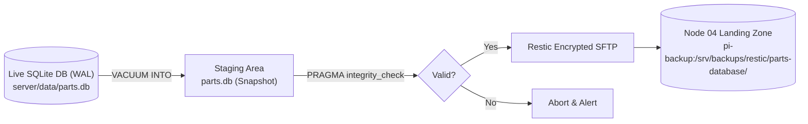

# Parts-Database Backup & Disaster Recovery Guide

---

## 1. Overview & Data Protection Architecture

The **Parts-Database** Web Catalog microservice maintains a persistent SQLite database (`server/data/parts.db`) in Write-Ahead Logging (WAL) mode.

To ensure zero-downtime backups, continuous data protection, and turnkey bare-metal recovery across the 10-node 2U rack infrastructure, the platform implements:
1. **Atomic SQLite Snapshots (`VACUUM INTO`)**: Creates defragmented point-in-time snapshots without blocking live catalog reads or quantity updates.
2. **Integrity Validation**: Runs `PRAGMA integrity_check;` before any remote transmission.
3. **Encrypted SFTP Backups to Node 04 (`pi-backup`)**: Pushes restic snapshots over SSH/SFTP to `pi-backup.local:/srv/backups/restic/parts-database/`.
4. **Retention Policy**: Keeps 14 daily, 8 weekly, and 12 monthly snapshots.
5. **Turnkey Bare-Metal Recovery (`bootstrap_node.sh`)**: Provisions a new node from bare metal in under 5 minutes.

---

## 2. Backup Pipeline Workflow



---

## 3. Operational Commands

### Manual On-Demand Backup
```bash
# Run backup pipeline
/bin/bash server/scripts/backup_parts.sh

# Run dry-run verification
/bin/bash server/scripts/backup_parts.sh --dry-run
```

### Inspect Snapshots on Node 04
```bash
restic -r sftp:detour@pi-backup.local:/srv/backups/restic/parts-database snapshots
```

### Restore to a Specific Snapshot
```bash
# Restore latest snapshot to temporary directory
restic -r sftp:detour@pi-backup.local:/srv/backups/restic/parts-database restore latest --target /tmp/parts_restore

# Copy restored database into place
cp /tmp/parts_restore/data/parts.db server/data/parts.db
```

### Turnkey Bare-Metal Node Provisioning
On a fresh Raspberry Pi OS installation:
```bash
git clone https://github.com/ericrowe/Small-Parts-Bins.git /opt/parts-database
cd /opt/parts-database
./server/scripts/bootstrap_node.sh
```

---

## 4. Verification & Health Checks

Verify that the local or restored database passes SQLite integrity verification:
```bash
sqlite3 server/data/parts.db "PRAGMA integrity_check;"
# Output must be: ok
```
